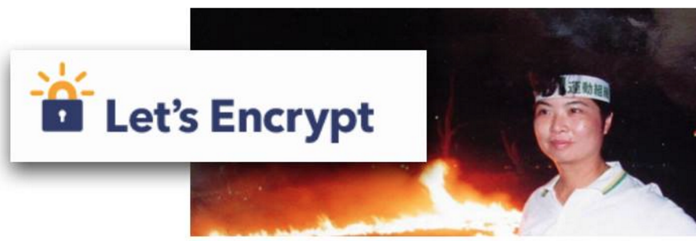

.. _h4e722d2a272f762d2879116f15666d54:

Let's Encrypt 是社會運動
************************

日期：2017年2月18日

最近很多雀躍著 Let’s Encrypt 發放「免費憑證(CA)」的網路po文，彷彿教士在宣揚神將降臨般熱情，宣傳重點在Let’s Encrypt不但免費而且只要幾分鐘就可以搞定。令人疑惑的是，如果取得憑證這麼不費吹灰之力，那憑證還是憑證嗎？釣魚網站不也是一樣容易取得憑證，網站還可以信任嗎？

憑證是架網站才用得到的一種機制，它的用處是讓瀏覽器（IE, Chrome等）不會跳出「這個網站可能不安全」的警告，對購物網站尤其關鍵。網站傳輸有兩種，沒有加密的是HTTP，有加密的是HTTPS/SSL。作為SSL加密的憑證（可想像成一把鑰匙）其實也可以自己DIY，憑證裡面包括了加密者的資訊，例如公司名稱，可這DIY出來的憑證資訊瀏覽器不認為是可以信賴的，所以它會跳出警語要瀏覽的訪客們再仔細考慮是否真的要進入這個網站，瀏覽器只認可經過國際憑證組織發出的憑證，這讓發放憑證成為一門好生意。

購買網路憑證不便宜，而且年年要繳年費。尤其想到DIY就可以的東西卻要花錢買簡直是搶劫，相對剝奪感異常強烈。這筆生意就跟天然瓦斯、第四台一樣，如果剛好趕上那個時代又站上那個位置的話可以建立傳世百代的基業。憑證當然要別人發不是自己DIY愛怎麼寫就怎麼寫，跟在憲法上宣稱領土範圍是不一樣的，付錢本是無可厚非，畢竟人家替你作擔保，至於多少才合理這就難講，就像保護費多少是流氓喊了算，不必多問。

\ |IMG1|\ 

Symantec CA 憑證的價目表 （2015/12，連結在文底）

Let’s Encrypt發放的憑證跟DIY的憑證一樣都是免費的，不同之處是它竟然是瀏覽器認可的，瀏覽器不會跳出警告。那麼Let’s Encrypt保證憑證資訊跟真實世界符合嗎？當然不可能。如果沒有確認憑證資訊的真實性就發出憑證，那麼瀏覽器認可Let’s Encrypt的憑證不就是打臉現在憑證層層管控的認證體系嗎？是的，完全正確！那麼，那些製造瀏覽器的大公司認可它的玄機何在？資安是充滿禁忌、迷信、謠言及恫嚇的領域，稍微改動一下就會招來很多質疑，就像把一頭牛丟進尼羅河馬上聚集一群食人魚，咄咄逼人地質問「你保證安全嗎、你保證嗎、你負責嗎、你用什麼負責、你什麼學歷、你有證照嗎、出事你會切腹還是跳樓嗎？」。Let’s Encrypt敢膽「破壞行情」的正當性又何在？

關於這個問題 Let’s Encrypt 的回答是：\ |STYLE0|\  Let’s Encrypt的論點大致歸納如下：

* CA只認證網域與擁有者之間的關係而不是網站內容。然而真正威脅資安的卻是內容。換言之，有CA的網站有可能含有不安全的內容。CA的安全只是一種假象。

* CA並沒有良好防堵釣魚網站跟病毒網站的機制。它也不是為此目的而設立的。

* 就算CA公司有偵測能力，CA機制的設計也無法提供足夠的防護。（CA是被動的，只能驗證憑證資訊）

* 各CA機構沒有共通防禦釣魚網站與病毒網站的標準，是瀏覽器公司強制要求的黑名單機制勉強應付那些意圖不良的網站，那些惡棍這家不賣別家買，拿到CA易如反掌。

有理，句句屬實，今天辛苦替使用者防堵釣魚網站跟病毒網站的人是瀏覽器，而不是那些憑證，憑證變得好像只是一個出得起價碼的高檔俱樂部，那些收入豐厚的釣魚網站跟病毒網站，說不定個個都是這個高貴俱樂部的永久榮譽會員。網站沒有憑證跳出警告會有關係嗎？以我個人為例，我每次都是當作沒看到跳過去，甚至有些是政府(gov.tw)的網站，還需要懷疑嗎，懷疑又有何用？

然而Let’s Encrypt並沒有提出「我能做的更好」的方法，或許也不必。Let’s Encrypt的目標在於把SSL從那些失能的憑證公司手中解放出來。目前，一般的共識是SSL在付款、登入會員區的場合是必備的，大部分其他的網站內容並沒有非SSL不可，Let’s Encrypt主張所有網站的所有傳輸都應該加密，他們認為網站傳輸加密不只是為了自己的安全，也是為了所有網路使用者的安全。他們又說這樣可以避免傳輸過程中被動手腳，加入有害的內容。如果你知道中國政府曾利用偉大長城攔截網頁並注入阻斷式攻擊碼癱瘓github（一個沒有它，軟體工程師就像被打回石器時代的網站），便會認同他們的主張有憑有據。由此也可看出Let’s Encrypt之所以命名為Let’s Encrypt ”讓我們來加密”的意義在此。

不必付保護費買憑證就能讓瀏覽器不產生告警這件事挺好的，確實可以提高使用SSL的意願非常多。如果只是傳圖片而已是否需要加密或許是見仁見智的。然而，可以肯定的是，讓Let’s Encrypt運動的聲勢繼續壯大，威脅到現有「憑證共榮圈」的經濟利益，或許就能給那些拿錢不辦事的人來點刺激。我們台灣人非常清楚：既得利益受到刺激有兩種反應，一種是開始反省，一種是開始反擊，會是哪一種還有待觀察。

話說回來，台灣有「千錯萬錯，只要擋人財路就死有餘辜」的文化。Let’s Encrypt顯然不吃這一套。想一想在那個憑證共榮圈內有多少資安專家、學者、博士跟媒體工作者？Let’s Encrypt膽敢說得憑證一無是處，今天的網路上處處凶險惡徒很多，可是依賴那些惡徒發戰爭財、災難財的就像在醫院內流竄賣特效藥的一樣多。這種挑戰權威的勇氣或許是要對抗網路惡勢力最起碼的勇氣吧。另一方面，Facebook, Google等世界性企業也以支持與贊助Let’s Encrypt的方式在這場運動中展現出不凡的高度。

能讓世界更好的，向來不是技術的進步，而是人心的進步。雖然你不架網站，這場運動你也可以參與，只要貴公司還在花錢買憑證當冤大頭，通報老闆娘跟財務部下令資訊部改用免費又方便的Let’s Encrypt就對了！

參考資料：

* \ |LINK1|\ 

* \ |LINK2|\ 

註：標題底圖是台灣社會運動第一戰將，有人稱「不知道什麼叫作害怕」的陳婉真小姐，本圖經同意引用，但內文並非陳小姐授意，文責在作者。

.. bottom of content

.. |STYLE0| replace:: **你們不必來問我，而應該去問那些發憑證的公司，他們收了錢又做了什麼？**

.. |LINK1| raw:: html

    <a href="https://l.facebook.com/l.php?u=https%3A%2F%2Fletsencrypt.org%2F2015%2F10%2F29%2Fphishing-and-malware.html&h=ATP1W6p8fgkilJ0GohprWsj18Ce_HEUXMxV16WNE1O-uLuR0WUmj8E4MvRcBM8XDT0_Ny8zR9gnl1aAfZ8ihaJfIh_JjnwQiGvL1y9a0rsIumcJ5OyR-K1bpJ7F_PghQA0TBlcu4pOERTw" target="_blank">The CA's Role in Fighting Phishing and Malware</a>

.. |LINK2| raw:: html

    <a href="https://l.facebook.com/l.php?u=https%3A%2F%2Fwww.symantec.com%2Fzh%2Ftw%2Fpage.jsp%3Fid%3Dcompare-ssl-certificates%23&h=ATP1W6p8fgkilJ0GohprWsj18Ce_HEUXMxV16WNE1O-uLuR0WUmj8E4MvRcBM8XDT0_Ny8zR9gnl1aAfZ8ihaJfIh_JjnwQiGvL1y9a0rsIumcJ5OyR-K1bpJ7F_PghQA0TBlcu4pOERTw" target="_blank">CA憑證售價表</a>

