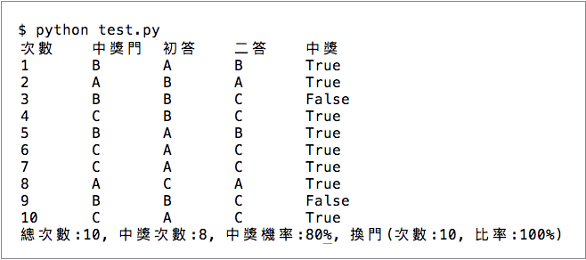
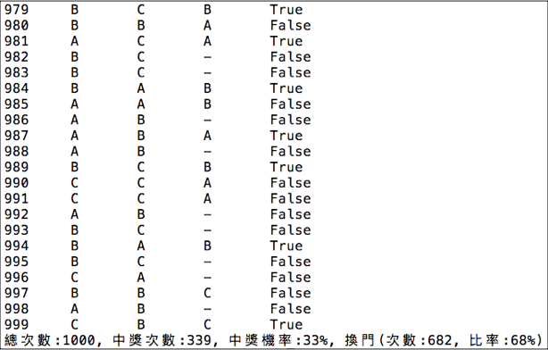

.. _h2164242e4c6048506f23311549231654:

蒙提霍爾問題
************

蒙提霍爾問題（Monty Hall problem ）來自於一個贈獎遊戲，主持人蒙提霍爾有三個門讓你選，其中一個門後面是汽車，另兩扇門是摃龜門，你選中那扇汽車門，門後汽車就是你的。你選定之後，主持人會開啟另外兩扇門當中的一扇摃龜門，剩下你選的那一個跟另一個可能是汽車也可能是摃龜的門，這時候，你可以決定是否要更換選擇。主持人可能會誘導你選擇摃龜那一扇，也可能不會。問題是，換門或不換哪一個比較好？

這個問題有趣的地方是，它違反直覺。直覺上，一開始三個門後是汽車的機率都是1/3，主持人開啟一個門之後，剩下兩扇門後的機率變成是1/2。換不換門應該不影響中獎機率，但是，實際上，你沒選中的那扇門後是汽車的機率竟然是2/3，也就是說，換門會更可能中獎。這表示你一開始不論是猜哪一扇門，都是比較爛的選擇，怎麼會這樣？

科學Online高瞻自然科學教學平台上這篇「\ |LINK1|\ 」文章內有詳細的說明，用機率說明為什麼換門會更好，以數學來講，這是條件機率的緣故。

.. _h1634483c7822441972316c7301545:

模擬
====

可是，我覺得這件事情還沒有結束。如果不知道錯在哪裡，只是把答案死背下來而已，不是真的理解。這種死背的假知識在下回應用的時候可能反而做出錯誤的判斷。我想應該繼續追究的問題是，到底直覺錯在哪裡？一開始，我覺得自己是缺乏「條件機率」的直覺，反覆觀看整個證明過程，嘗試建立「條件機率」的直覺。然而，總是覺得對於「條件機率」的直覺依然不能成功的建立起來。後來，我決定寫一段Python程式，嘗試模擬遊戲的整個過程。

.. code-block:: python
    :linenos:

    #! -*- coding:utf-8 -*-
    # test.py
    #
    # Simulation of "Monty Hall problem"
    # See http://highscope.ch.ntu.edu.tw/wordpress/?p=47158 for details.
    #
    # By Iap, Singuan (Feb 12, 2017)
    # 
    # Copyright © 2017, BSD License
    #
    import random
    class Question(object):
        options = ['A','B','C']
        def __init__(self,idx):
            self.idx = idx
            self.answer = self.options[random.randint(0,len(self.options)-1)]
            self.choice = ''
            self.originChoice = ''
            self.openedOption = ''
            self.win = None
        def choose(self,c):
            self.choice = c
            self.originChoice = c
        def openDoor(self):
            options = self.options[:]
            options.remove(self.answer)
            if self.answer != self.choice:
                options.remove(self.choice)
            self.openedOption = options[random.randint(0,len(options)-1)]
        def switchChoice(self):
            options = self.options[:]
            options.remove(self.choice)
            options.remove(self.openedOption)
            self.choice = options[random.randint(0,len(options)-1)]
        def finish(self):
            self.win = self.choice == self.answer
    
    def generateQueustion(n=10):
        questions = []
        for i in range(n):
            questions.append(Question(i))
        return questions
    
    def main():
        options = Question.options
        n = 10
        questions = generateQueustion(n)
        winCount = 0
        switchCount = 0
        optionsLength = len(options)
        for question in questions:
            question.choose(options[random.randint(0,len(options)-1)])
            question.openDoor()
            #if random.randint(0,1)==0: ## 換不換門的機率一半一半
            if random.randint(0,1)<optionsLength: ## 一定換門
            #if random.randint(0,1)>optionsLength: ## 一定不換門
                question.switchChoice()
                switchCount += 1
            question.finish()
            if question.win: winCount += 1
    
        lines = ['\t'.join(('次數','中獎門','初次選擇','最終選擇','中獎與否'))]
        for question in questions:
            line = [question.idx,question.answer, question.originChoice, question.choice, question.win]
            lines.append('\t'.join(map(lambda x: str(x),line)))
        switchPercent = int(100*float(switchCount)/len(questions))
        lines.append('總次數:%s, 中獎次數:%s, 中獎機率:%s%%, 換門(次數:%s, 比率:%s%%)' % (len(questions),winCount,int(100*float(winCount)/len(questions)), switchCount, switchPercent))
        print '\n'.join(lines)
    
    
    if __name__ == '__main__':
        main()

執行結果如下圖：

\ |IMG1|\ 

在程式的53-56行，可以切換不同的策略。執行幾次之後，的確顯示出換門是比較好的策略。但是，這不是重點，因為在機率計算下，本來就應該這樣，如果不是的話，是程式有BUG。這也不是「用程式證明了數學推導」畢竟用的只是尋常的random函式而已，不是嚴格的模擬。

.. _h2164242e4c6048506f23311549231654:

直覺錯在哪裡
============

然後，在寫程式的過程中，我領悟出為什麼我的直覺會出錯。我發現出錯的關鍵在於我沒有考慮到「主持人決定開哪一扇門」這個行為，一直到我寫到主持人開門的這一段程式。請看程式中第25行附近的 openDoor 子函數。

.. code:: python

        def openDoor(self):
            options = self.options[:]
            options.remove(self.answer) #不能開中獎門
            if self.answer != self.choice: #不能開你已選擇的那個門
                options.remove(self.choice)#移除此門之後，只剩下一個門可以開
            self.openedOption = options[random.randint(0,len(options)-1)]

當主持人選擇要開啟哪一扇摃龜門的時候，其實他的選擇很有限，首先，不能是你選的那一個，其次，不能是中獎的那一個。他開門遵守「一定不能開中獎門」規則的行為，為此系統注入一個明確的資訊使得「他不開的那一個是汽車」的可能性大增。

.. _h174fb648377959437b5c1f697c1c40:

驗證方式
========

我的直覺會錯誤原因在於我只是從自己的觀點作純機率的考量，沒有將主持人的行為納入考量。但是，這一推測也只是「直覺」，怎麼確定是對的呢？我檢驗的方式是：把限制主持人開門的規則拿掉，也就是說，假設主持人不知道哪一扇門後是汽車，他從遊戲者挑剩的兩扇門中隨機開啟其中的一扇門，如果開出汽車則遊戲結束，如果不是，則遊戲者可以選擇換門或不換門。修改遊戲規則之後的模擬程式碼如下：

.. code-block:: python
    :linenos:

    #! -*- coding:utf-8 -*-
    #
    # Simulation of "Monty Hall problem" (Door opened blindly)
    #
    # By Iap, Singuan (Feb 12, 2017)
    # 
    # Copyright © 2017, BSD License
    #
    
    import random
    class Question(object):
        options = ['A','B','C']
        def __init__(self,idx):
            self.idx = idx
            self.answer = self.options[random.randint(0,len(self.options)-1)]
            self.choice = ''
            self.originChoice = ''
            self.openedOption = ''
            self.win = None
        def choose(self,c):
            self.choice = c
            self.originChoice = c
        def openDoorBlindly(self):
            options = self.options[:]
            options.remove(self.choice)
            self.openedOption = options[random.randint(0,len(options)-1)]
            if self.openedOption == self.answer:
                self.win = False
                return True
        def switchChoice(self):
            options = self.options[:]
            options.remove(self.choice)
            options.remove(self.openedOption)
            self.choice = options[random.randint(0,len(options)-1)]
        def finish(self):
            self.win = self.choice == self.answer
    
    def generateQueustion(n=10):
        questions = []
        for i in range(n):
            questions.append(Question(i))
        return questions
    
    def main():
        options = Question.options
        n = 1000
        questions = generateQueustion(n)
        winCount = 0
        switchCount = 0
        optionsLength = len(options)
        for question in questions:
            question.choose(options[random.randint(0,len(options)-1)])
            if question.openDoorBlindly():
                # 已經被主持人抽中，遊戲結束
                question.choice = None
                continue
            #if random.randint(0,1)==0: ## 換不換門的機率一半一半
            if random.randint(0,1)<optionsLength: ## 一定換門
            #if random.randint(0,1)>optionsLength: ## 一定不換門
                question.switchChoice()
                switchCount += 1
            question.finish()
            if question.win: winCount += 1
    
        lines = ['\t'.join(('次數','中獎門','初次選擇','最終選擇','中獎與否'))]
        for question in questions:
            line = [question.idx,question.answer, question.originChoice, question.choice or '-', question.win]
            lines.append('\t'.join(map(lambda x: str(x),line)))
        switchPercent = int(100*float(switchCount)/len(questions))
        lines.append('總次數:%s, 中獎次數:%s, 中獎機率:%s%%, 換門(次數:%s, 比率:%s%%)' % (len(questions),winCount,int(100*float(winCount)/len(questions)), switchCount, switchPercent))
        print '\n'.join(lines)
    
    
    if __name__ == '__main__':
        main()

執行結果如下圖：

\ |IMG2|\ 

其中第四欄位是 dash "-" 表示該次提早結束。我測試了三種策略（換、不換、隨機換），模擬結果都是一樣的，中獎機率都是33％，跟瞎猜一樣。

.. _h1634483c7822441972316c7301545:

結論
====

所以，我相信我的推測是正確的，在原本的遊戲規則中，主持人的行為提升了最後那扇門後面是汽車的機率，使得換門成為一個比較好的選擇。我們一開始瞎猜的選擇並沒有比較差，而是後來出現了更好的選擇，這是換門會更好的原因。直覺的錯誤是因為直覺沒有察覺到出現了更好的選擇。

或者，換一個觀點來看，在決定是否換門的當下，這兩次的選擇是在不同的情境，第一次選擇時，汽車是隨機出現在三個門當中。然而，第二次選擇時，汽車不是隨機出現在兩個門，汽車「被安置」在最後剩餘的那一個門的機會是⅔. 有意思的地方是，「隨機」竟然不是絕對的，當某一個知道秘密的人做出某種行為時，原本的隨機性竟然改變了。

「主持人知道門後的秘密，刻意避開開啟中獎那扇門的行為，反而提高了他沒開的那扇門的中獎機率」這件事情好像是違反一般的直覺，但這在日常生活中卻是很常見的，例如國防部對於任何軍事相關的問題一概不承認不否認，因為只要給出某種確定性便會改變某些其他事情的機率，如果要隱藏某些資訊，所謂虛虛實實，實實虛虛，才是好的策略，這道理孫子兵法早有闡述，實例可就不勝枚舉了。

我們做出選擇之後，應該注意是否出現了新的情勢，使得當初放棄的選項已經成為更好的選項。尤其是當系統中有知情的行動者做出某一特定的行為時（譬如創辦人出脫持股），他的行為可能改變了某些選項的可能性。

..  Caution:: 

    話說回來，我們必須記住「可能性永遠只是可能性」，千萬不能把「最可能」與「事實」相混淆。

.. bottom of content

.. |LINK1| raw:: html

    <a href="http://highscope.ch.ntu.edu.tw/wordpress/?p=47158" target="_blank">蒙提霍爾問題（一）決勝21點</a>

