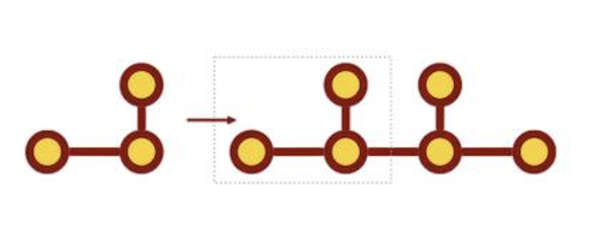

\ |IMG1|\ 

寫程式是建構式的

\ |LINK1|\ 

建構式？沒錯，是「建構式數學」的「建構式」。

上週在討論搜尋graph pattern的問題，有人說他已經能搜尋較單純的pattern: 3個 vertices跟2個edge, 但更複雜的就做不出來了。

更複雜的圖形是可以由簡單的開始搜尋起，搜尋複雜的模式，可以先把複雜圖形拆解成簡單圖形，再分別找出符合簡單圖形的樣本，然後再以那些樣本作為搜尋的起點，逐步過濾，逐步縮小範圍。

在發展一個系統的過程中，經常會遇到這種從簡單開始而逐步建構出複雜系統的循環，軟體開發中有所謂的unit test，也就是測試一個元件，複雜的系統是由一個一個的元件及其之間的資訊流動所構成的。元件之間也可能先組成一個較大的元件，然後再繼續向上擴展成更大的元件，建構成一個階層式的組織。

這過程跟數學家遇到困難的問題，經常從特例開始解題是類似的處理手法。羅馬不是一天造成的，困難的數學題目（求解、求一般解、證明等）、複雜的資訊系統都是逐步建構出答案與成果。

如果要說的更詳細一點，建構跟解構兩者是一體兩件，在建構的過程中也會作解構，解構是為了下一步的建構，這跟蓋房子可能有點不一樣，蓋房子會一層一層往上蓋起來，但建構與解構的循環過程中，有時會「砍掉重練」作大規模的解構以便於作更大或更有包容力的建構。或者，選擇一種quick and dirty的作法，就好比是臨時搭建違章建築一樣。這是實際的開發過程，畫成甘特圖是像下圖這樣，但大概沒有人會提出這種甘特圖，去google 甘特圖圖片也看不到這種情況，因為會被老闆打槍被同事取笑，沒人願意面對砍掉重練會更好的事實。

程式開發實際的甘特圖

開發工程師有兩種選擇：一、自己吸收延宕的日程。二、用蓋違建的方式處理。第一種有爆肝、被主管修理與同事嘲諷的風險，第二種有最後倒塌收拾爛攤子的可能。哪一種比較多我不知道，但我知道有不少人上班第一天就開始收爛攤子。

很多家長認為把九九乘法表背起來才是學數學。依據wikipedia的資料，九九乘法表是兩千多年前戰國時代的產物，自從九九乘法發明之後，數學已經大有演進，數學不只是在找尋標準答案而已，數學的精彩之處早已經遠遠超過九九乘法表，甚至早在一百多年前就已經發展到把「數學＝真理」的信念推翻，當然，這只是其中一個學派，數學本身是多元的，而且那些學派都是專業的數學家形成的，是立基於許許多多一流數學家的成果所發展出來的理念與思路，不是家長、老師、校長跟補習班老師組成的協會所喊出來的口號。如果你對數學發展史有興趣，商務印書館出版，〈〈數學：確定性的失落〉〉一書，趙學信、翁秉仁的翻譯很棒，內容很精彩。

「數學就是用最快的方式找到標準答案」讓很多人在求學過程中脫穎而出，然而那不是現實的數學發展過程，在數學課堂上數學老師三兩下就完成的解答，那些精簡的運算過程是數學老師「推理」出來的嗎？未必，實際上可能是上百年數學發展才有的結果，學生聽不懂並不是因為笨，只是因為他是正常的一般人。發展系統也有類似的情況，如果一段程式有100行，可能在之前的版本有500行。這100行也可能在下一階段又變成結構完全不一樣的500行。我們對問題的了解是逐步增加的，隨著對問題了解的越深入，解決問題的手法也就越完整，現實情況是這樣。那些歷史上的數學天才，多的是一輩子只解決了少數的問題。我們除了看到他們的天分之外，更重要的是要看到人家的專注、耐心以及不接受隨便答案愚弄自己的堅持。

我們都經歷過所謂的「填鴨式教育」，也就是「能通過考試就算懂」，這其實只是在作一種表演，表演給老師看「我有多麼用功在向您學習」，歸根究柢是在取悅老師跟家長，是不是真懂老師跟家長並不關心，久而久之學生自己也不關心了。建構式數學在考試至上的填鴨式系統裡面運作，會變成過街老鼠那般人人喊打是無法避免的結果。如果我們關懷下一代的競爭力，我們撼動不了「填鴨式教育」，但或許可以讓自己的小孩不受「填鴨式教育」的荼毒。我們可以幫助他們從那種充滿「一步到位，答案就在眼前」的天才神話中得見真相，數學成績不好並沒有那麼糟糕。數學不等於能立刻回答出標準答案，而是一個逐步逼近解答的過程，如同所有在真實世界發生的事情一樣，都是多元價值，充滿各種可能的世界，這個世界對所有平凡但不放棄的人敞開著大門，不必因為自己在填鴨式教育裡面失敗而感到自卑與挫折。

開發新的軟體系統不是一件像是補習班老師在黑板上作因式分解那樣「聰明的人一看到就知道該怎麼解」。開發軟體系統像是面對數學問題一樣，是逐步求出解答的，不是有個像是九九乘法表那樣的東西可以查，或者像是到自助餐店買便當那樣，東挑西挑就可以完成。這是開發系統寫程式有趣的地方，一步一步逼近答案，就像是解數學題目一樣，需要時間與耐心，但不必像數學天才那般的才華，只需要具備跟他們面對邏輯理性相同謙卑的態度。

寫程式是一種建構式的思想毒品，想到建構式數學就有湧上一股深惡痛絕之感的人，最好不要碰，會上癮！

.. bottom of content

.. |LINK1| raw:: html

    <a href="https://www.facebook.com/notes/%E8%91%89%E4%BF%A1%E6%BA%90/%E5%AF%AB%E7%A8%8B%E5%BC%8F%E6%98%AF%E5%BB%BA%E6%A7%8B%E5%BC%8F%E7%9A%84/10153234361738601" target="_blank">2015年11月22日</a>

