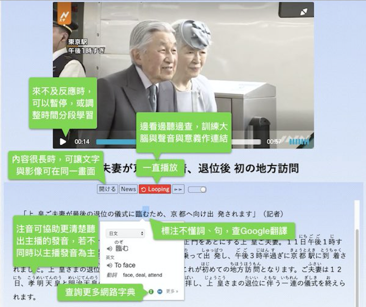

.. _h507524361a55b2f195d763e73767f36:

日語學習相關連結
################

.. _h7831321ac527a2d1919781d15503f:

學習工具：Chrome外掛 （桌機／筆電版）
*************************************

* 安裝\ |LINK1|\  (請將慣用語言改為「英文」）

* \ |LINK2|\ 

..  Hint:: 

    * 把Google翻譯外掛習慣語言改成英文的目的是為了把外來語以原文顯示。用外來語的原文可以幫助同時記憶聲音跟文字。
    
    * Furikanji的\ |LINK3|\ 及\ |LINK4|\ 

.. _h174fb648377959437b5c1f697c1c40:

訓練網站
********

..  Hint:: 

    必須使用筆電或者桌機的Chrome開啟連結，才能啟動外掛。反覆一直看新聞、聽種播讀稿，利用Furikanji及Google翻譯外掛，把新聞內容讀懂（盡可能，不必全懂，專注在懂的部分；所謂懂是指能在內心產生畫面的部分，不是懂中文翻譯）

* \ |LINK5|\  （也可以從Furiknaji的小圖\ |IMG1|\ 開啟，在Chrome右上角）

.. _h174fb648377959437b5c1f697c1c40:

訓練方式
********

..  Tip:: 

    重點：讓大腦反覆進行「聲音連結意義」的刺激

\ |IMG2|\ 

.. _h174fb648377959437b5c1f697c1c40:

測試網站
********

..  Hint:: 

    有些可以在自己的手機上開啟，瞭解自己聽力進步的情況。並且享受聽懂日語的樂趣。也可以當成訓練網站，先搭配畫面看懂新聞大致的內容，在開車時只聽聲音，回想畫面的內容，多聽幾次，當內心所能重構的意象越來越清晰時就是越來越懂了。

* \ |LINK6|\ 

* \ |LINK7|\  (有些影片帶有字幕，但外掛無法加注音）

* \ |LINK8|\  （限桌機／筆電）

* 其他Youtube上的日語影片，例如紀錄片、綜藝節目等。以下是一些我個人覺得有內容或有趣的影片，僅供參考。

    * \ |LINK9|\  NHK的近代史紀錄片，製作精美，有不少非常罕見的影像是台灣媒體看不到的。因為版權問題經常被刪掉，但過一陣子又會有人貼出來。

    * \ |LINK10|\  兩個年輕人，身無分文一路打工，以搭便車從香港經由印度、巴基斯坦到倫敦的過程。途中經過的地區很多是不會有旅行團去的，所接觸的人、事、物也不是一般旅遊節目看得到的，會打破我們對很多國家的刻板印象。其中有個主角甚至在某個國家因為好幾天沒錢吃飯，營養不良而送醫。打工賺到的錢還曾被騙光。但他們最後竟然辦到了！

    * 「電波少年」這一系列影片是1995年左右的影片，以年輕人出任務為主題的節目，那些任務都是些有點無厘頭、刺激，一般人不會做的事，例如去跟街頭上看似流氓的人宣導不要抽煙、不要吸毒；或者到西西里島的街頭，問路人哪裡可以找到黑道，一路找過去，最後真的被帶到黑道大本營的經過。影片刺激又有趣，請自行在Youtube上探索。

    * \ |LINK11|\  講一些日本近代史的觀點（偏右派，台灣比較少見的觀點）

    * \ |LINK12|\  現代版在阿富汗的「八田與一」。中村哲醫師將一片黃沙滾滾的沙漠化為綠油油良田的完整紀錄片。那種前後變化對照的畫面，我感覺非常神奇，實際深刻體會到「八田與一」對台灣的貢獻。這部紀錄片也是NHK做的，品質很好。

.. admonition:: 語言傳達過程的圖解；走正路，不要走偏路

    \ |IMG3|\ 

.. admonition:: 日語學習重點

    * 用嬰兒的方式學，不要用學校教英文的方式學
    
    * 先學日語再學日文
    
    * 使用furikanji反覆聽＋理解；養成「聲音──意象」的直接反應。忘記華語才能學好日語。
    
    * 語言學習是從模糊到清晰的過程。不是低階到高階的過程。
    
    * 學習有各種方法，只有越學越有趣就是對的方法。對的方法一開始慢，後來會越來越快。錯誤的方法一開始快，但是後來會越來越慢。

.. bottom of content

.. |LINK1| raw:: html

    <a href="https://chrome.google.com/webstore/detail/google-translate/aapbdbdomjkkjkaonfhkkikfgjllcleb?hl=zh-TW" target="_blank">Google 翻譯</a>

.. |LINK2| raw:: html

    <a href="https://chrome.google.com/webstore/detail/furikanji/plpdljndcikodkdhcbcbfnbmeplcjdeh" target="_blank">安裝Furikanji</a>

.. |LINK3| raw:: html

    <a href="https://iapyeh.readthedocs.io/en/latest/blogs/myworks/I.F.Add-on.html" target="_blank">使用說明</a>

.. |LINK4| raw:: html

    <a href="https://www.youtube.com/watch?v=5wwFgygTmVs&feature=youtu.be" target="_blank">DEMO影片</a>

.. |LINK5| raw:: html

    <a href="http://news.tbs.co.jp/3snewsi/index.html#_" target="_blank">TBS 連続動画</a>

.. |LINK6| raw:: html

    <a href="https://www.youtube.com/watch?v=coYw-eVU0Ks" target="_blank">Youtube上的ANN News (新聞直播）</a>

.. |LINK7| raw:: html

    <a href="https://www.facebook.com/tbsnews/" target="_blank">Facebook 上的TBS News</a>

.. |LINK8| raw:: html

    <a href="https://www.nhk.or.jp/school/" target="_blank">NHK School</a>

.. |LINK9| raw:: html

    <a href="https://www.youtube.com/watch?v=JXX4lh-AiHc" target="_blank">新・映像の世紀</a>

.. |LINK10| raw:: html

    <a href="https://www.youtube.com/watch?v=k_p4kd-8c9U" target="_blank">猿岩石，電波少年橫渡歐亞</a>

.. |LINK11| raw:: html

    <a href="https://www.youtube.com/channel/UC24I2gsaEx_zfrRHQphjj-w" target="_blank">The Fact</a>

.. |LINK12| raw:: html

    <a href="https://www.youtube.com/watch?v=Fu_iiTKIeos" target="_blank">医師中村哲</a>

