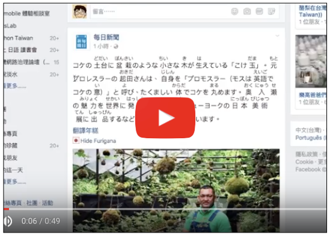
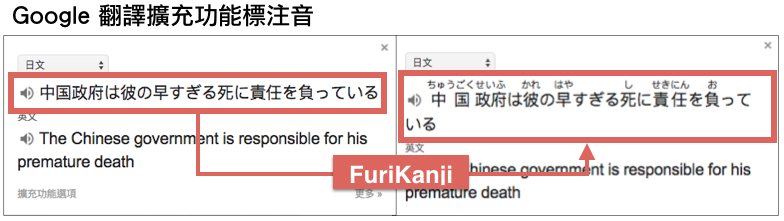
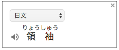
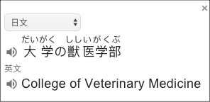
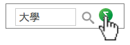

.. _h3fd6ce35505251235a486c3c33372e:

\ |IMG1|\  FuriKanji
********************

把Chrome瀏覽器轉變成日文學習工具的擴充功能

.. _h2c59317252ab342915276721104255:

與「Google翻譯擴充功能」合用
============================

也許你跟筆者我一樣安裝了Chrome的「Google翻譯擴充功能」作為學習日文的工具，但是，除了翻譯之外，我們希望能夠有更多的日文學習功能，例如知道漢字怎麼讀，以及能查詢線上辭典，因此有了FuriKanji 這個Chrome擴充功能。

「FuriKanji擴充功能」有標注音（振り仮名）、查辭典、背單字三種功能，可以單獨使用，也可以與「Google翻譯擴充功能」一起搭配使用，使得Chrome瀏覽器成為一個具備完整的「注音＋翻譯＋辭典＋學習」的日文學習工具。

\ |IMG2|\ 

.. admonition:: 小提示：用英文學日文

    筆者我的使用經驗是：Google翻譯的「日翻中」功能超爛，但「日翻英」功能還算可以。如果你的英文還算OK的話，除了用中文學日文之外，也可以同時用英文學日文，好處是：
    
    * 避免中文與日文漢字的認知之間互相干擾
    
    * 可直接得到外來語的本字，這對於理解外來語非常方便。スーツケース
    
    要讓Google翻譯將日文翻譯為英文，你可以進入Google翻譯中修改「我的主要語言」設定。

.. _h65a754d314849631d4f1770f68746b:

提供多個辞書網站的整合搜尋
==========================

網站、Youtube、翻譯、線上辞書提供日文學習者非常豐富的資源，然而筆者的經驗是，這些線上的學習資源都不如一位實際的日文老師。日文老師能全方位的解決學習者的疑惑，而線上的各種日文學習相關網站是各有自己的強項，所以在沒有日文老師指導的情況下，自學者需從很多的網站上自行尋找解答。

「FuriKanji擴充功能」提供多個線上辞書網站的整合，你可以從「Google翻譯擴充功能」或網頁內圈選的字、句帶出線上辞書的查詢網頁，並且在多個線上辞書之間跳躍，不需要重新輸入查詢的關鍵字。

.. _h131a6854a7b2a61393f776593d2918:

與Facebook整合
==============

Facebook是日文學習的一個很豐富的來源。例如訂閱日文的相關粉絲團與社團，會在塗鴉牆上出現一則一則的日文貼文。由於Facebook的貼文是動態增加的，許多標注音的擴充功能無法發揮。「FuriKanji擴充功能」特別替Facebook的特性設計替貼文上的日文漢字加注音的功能。當「FuriKanji擴充功能」偵測到貼文有日文時，你可以自由選擇是否加替貼文中的漢字標注音。

.. _h35446973605e2d3cc1c7f4f1f655:

與NHK School 整合
=================

NHK School的影片區位於內嵌網頁內，其他標注音的擴充功能無法在內嵌網頁內運作，「FuriKanji擴充功能」因此無法替NHK School影片說明內的漢字標注音，「FuriKanji擴充功能」特別為解決此問題而開發了在內嵌網頁也能運作的功能。（尺寸小於500x500的內嵌網頁或隱藏性內嵌網頁，「FuriKanji擴充功能」視為廣告性內嵌網頁不會在廣告性內嵌網頁內運作。）

.. _h1a723e4563621513a2d70487835277:

與Jisho網站整合
===============

\ |LINK1|\ 是一個很棒的線上辞書網站，但是這個網站標注音的方式使用與其他網站標注音不一樣的方式，導致其他標注音的擴充功能無法在此網站正常運作，而且「Google 翻譯擴充功能」也會因為無法正確圈選到所要翻譯的日文而無法正常運作。「FuriKanji擴充功能」特別為Jisho網站客製化以解決這些問題。

.. _h2164242e4c6048506f23311549231654:

其他重點功能
============

「FuriKanji擴充功能」的特點如下：

* 在「Google 翻譯擴充功能」彈跳出來的顯示視窗上的日文漢字也能顯示Furigana

    * 「Google 翻譯擴充功能」譯文框上的日文漢字原本沒有注音。「FuriKanji擴充功能」會加上注音，並且滑鼠一點就可以查字典。

* 顯示使用者所選擇的日文漢字的注音。

    * FuriKanji只顯示使用者圈選的文字。這樣可以改善顯示速度，尤其是遇到像是Facebook這種很長很長的網頁時，或者遇到中日文夾雜的網頁時，常常我們只需要顯示部份的漢字注音。

    * 對於在輸入欄位(input, textarea)所選取的日文漢字也有作用。

* 連結辞書網站。

    * 使用者點選「Google 翻譯擴充功能」譯文框內的漢字或網頁下方的顯示板內的漢字時，會連結到「ふりがな文庫」辞書網站查詢該漢字。

    * 按住ALT鍵選擇多個漢字及非漢字的話，會將選擇的內容當關鍵字連結到Yahoo辞書作查詢。

* 讓日文注音可以顯示跟隱藏

    * 有些網站本來就有Furigana，或者是使用「IPA Furigana擴充功能」這一類擴充功能替漢字加上注音之後，然而這些日文注音會導致「Google 翻譯擴充功能」錯誤解讀所要翻譯的文字內容。「FuriKanji擴充功能」會將網站上的Furigana暫時隱藏起來，讓使用者可以圈選原本的日文漢字，使得「Google 翻譯擴充功能」可以翻譯正確的內容。

    * 隱藏之後使用者可以用滑鼠靠近漢字來顯示該漢字的注音。

    * 使用者也可以透過這個功能測試自己是否在沒注音時也能正確讀出漢字。

.. _h92c4b6924343a444a3615c5e5b1378:

替「Google 翻譯擴充功能」加入日文學習功能
=========================================

「Google 翻譯擴充功能」是一個很棒的擴充功能，但畢竟不是專為日文學習者而設計，為了讓「Google 翻譯擴充功能」更合適於日文學習，「FuriKanji擴充功能」做了幾個修改：

* 日文被誤認為中文時，會在旁另外顯示一個「漢字よ」讓使用者快速改變成日文。如下圖：

    * \ |IMG3|\ ，然後就會像這樣：

    * \ |IMG4|\ 

* 可直接在網頁內修改「翻譯Google 擴充功能選項」，不另開視窗。因為日文翻英文比較準確，所以翻譯日文時，「\ |STYLE0|\ 」要設定成「英文」。然而要閱讀英文時，又要把「\ |STYLE1|\ 改回來。直接在網頁內修改這樣會使得修改「\ |STYLE2|\ 」時比較方便。

.. _h174fb648377959437b5c1f697c1c40:

安裝方式
========

* 請用Chrome點選開啟： \ |LINK2|\ 

* 請用Chrome點選開啟：\ |LINK3|\  （如果已經安裝請忽略）

.. _h174fb648377959437b5c1f697c1c40:

使用要領
========

.. _h2164242e4c6048506f23311549231654:

啟動與關閉：
------------

    每一個網頁都可單獨開啟或關閉FuriKanji的功能

    關閉狀態是藍色小圖\ |IMG5|\     ，此時點一下藍色小圖就會啟動「FuriKanji擴充功能」

    開啟狀態是紅色小圖\ |IMG6|\     ，此時點一下紅色小圖後選擇「關閉」可在該網頁關閉「FuriKanji擴充功能」。

    「FuriKanji擴充功能」能偵測網頁是否含有日文內容，並自動開啟。如果你不需要此功能可以在「設定」中關閉。

.. _h6a463227652759327716b593ec68a:

標注音-- 無「Google翻譯擴充功能」時
-----------------------------------

    把要標注的漢字選起來像這樣

\ |IMG7|\ 

    「FuriKanji擴充功能」會在網頁下方顯示圈選文字的注音，並在取消圈選文字五秒之後自動消失。

.. _h6a463227652759327716b593ec68a:

標注音-- 有「Google翻譯擴充功能」時
-----------------------------------

    把要標注的漢字選起來會像這樣

\ |IMG8|\ 

    點一下圈選區右下方的小圖示後，「Google翻譯擴充功能」上的日文會顯示注音，如下圖：\ |IMG9|\ 

..  Tip:: 

    網頁中連結的文字無法直接用滑鼠選取，可以先「按住ALT鍵」然後再用滑鼠選取。

.. _h174fb648377959437b5c1f697c1c40:

辞書查詢
--------

    將滑鼠移到有注音的漢字上方後，點選該漢字就可以開啟查詢頁面。

\ |IMG10|\ 

    FuriKanji預設的查詢的辞書是 「ふりがな文庫」。這個網站是Furigana的專門網站，內容豐富，速度快又沒有廣告，是學習ふりがな很棒的網站。

    綠色的\ |IMG11|\     小圖是用來切換到其他辞書查詢的按鈕，它會顯示在辞書原有的「查詢按鈕」右邊。按下這一個按鈕後即切換辞書網站，不需重新輸入關鍵字。

\ |IMG12|\ 

.. _h2164242e4c6048506f23311549231654:

節省系統資源
============

很多擴充功能，像是「Google 翻譯擴充功能」會在使用者瀏覽所有網頁自動運行，使得Chrome消耗比較多的系統資源。FuriKanji是一種開關型的擴充功能，在網頁上手動啟動之後只會在該網頁上運行。使用者可以需要的時候才開啟FuriKanji，並且在不需要的時候關閉它。

* 當使用者暫時離開Chrome，切換到其他應用程式(例如Word)，或者切換到其他分頁時，FuriKanji所運行的視框(frame)不再是使用者的焦點(focus)時，FuriKanji會自動暫停以節省系統資源。

.. _h68017771fa7c85ef23567fe7b5a:

致謝與推薦連結
==============

* 「\ |LINK4|\ 功能

* 「\ |LINK5|\ 

.. _h174fb648377959437b5c1f697c1c40:

已知問題
========

* 受限於斷詞能力及字典收錄的問題，日文漢字標注音無法保證百分之百正確。

.. _h174fb648377959437b5c1f697c1c40:

回報問題
========

您可以利用「Facebook訊息」將訊息傳給\ |LINK6|\ 

.. _h174fb648377959437b5c1f697c1c40:

改版紀錄
========

+---------+--------------------------------------------------------------------------------------------------------------+
|版本     |主要異動                                                                                                      |
+---------+--------------------------------------------------------------------------------------------------------------+
|1.17.7.13|* 為了在Google翻譯擴充功能提供Furigana，所以單獨提供Furigana功能。如此一來，導致使用者不必再安裝IPA Furigana。|
|         |                                                                                                              |
|         |* 從I.F. Add-on改名為 FuriKanji                                                                               |
+---------+--------------------------------------------------------------------------------------------------------------+
|1.17.5.26|讓\ |LINK7|\ 可與Google翻譯擴充功能一起使用。                                                                 |
+---------+--------------------------------------------------------------------------------------------------------------+
|1.0      |2017/1/26 首次發布，名稱為「I.F. Add-on」，是一個\ |LINK8|\                                                   |
+---------+--------------------------------------------------------------------------------------------------------------+

\ |LINK9|\ 

.. bottom of content

.. |STYLE0| replace:: **我的主要語言**

.. |STYLE1| replace:: **我的主要語言」**

.. |STYLE2| replace:: **我的主要語言**

.. |LINK1| raw:: html

    <a href="http://jisho.org/" target="_blank">Jisho</a>

.. |LINK2| raw:: html

    <a href="https://chrome.google.com/webstore/detail/if-add-on/plpdljndcikodkdhcbcbfnbmeplcjdeh" target="_blank">FuriKanji 擴充功能</a>

.. |LINK3| raw:: html

    <a href="https://chrome.google.com/webstore/detail/google-translate/aapbdbdomjkkjkaonfhkkikfgjllcleb" target="_blank">Google 翻譯擴充功能</a>

.. |LINK4| raw:: html

    <a href="https://www.npmjs.com/package/kuroshiro" target="_blank">FuriKanji翻譯擴充功能」使用KuroShiro的Furigana API提供Furigana</a>

.. |LINK5| raw:: html

    <a href="https://www.youtube.com/watch?v=OZZlEuE8RdU" target="_blank">FuriKanji翻譯擴充功能」的考試模式靈感來源</a>

.. |LINK6| raw:: html

    <a href="https://www.facebook.com/singuan.iap" target="_blank">這個帳號</a>

.. |LINK7| raw:: html

    <a href="https://chrome.google.com/webstore/detail/ipa-furigana/jnnbgnfnncobhklficfkdnclohaklifi" target="_blank">IPA Furigana 擴充功能</a>

.. |LINK8| raw:: html

    <a href="https://chrome.google.com/webstore/detail/ipa-furigana/jnnbgnfnncobhklficfkdnclohaklifi" target="_blank">IPA Furigana擴充功能的patch</a>

.. |LINK9| raw:: html

    <a href="https://docs.google.com/document/d/1X6sOdxpKFERm49a07BU4QFOuZeqDuWjNfdJWXU7VKrI/edit" target="_blank">本文件原始檔案</a>

.. |IMG1| image:: static/I_F_Add-on_1.png
   :height: 29 px
   :width: 29 px

.. |IMG7| image:: static/I_F_Add-on_7.png
   :height: 44 px
   :width: 388 px

.. |IMG10| image:: static/I_F_Add-on_10.png
   :height: 98 px
   :width: 300 px

.. |IMG11| image:: static/I_F_Add-on_1.png
   :height: 20 px
   :width: 20 px

