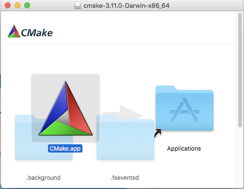

.. _h51c204e94f6b561c64555c2e7b4d3c:

Install PyTorch in MacOS 10.13.3
################################

PyTorch的官方網站推薦使用conda安裝，如果你的Python已經是 conda的版本，根據官網的建議即可。但如果不是，可以依照本文內容的方式安裝。

.. _h572187820253c7294643631303029:

適用環境：
**********

#. 在 MacOS 10.13.3 High Sierra 

#. 不使用 conda 安裝

#. Python3

測試Python是否為conda的版本的方式：（開一個終端機）

.. code:: 

    $ which python
    
    # 以下這種回應表示你的python是conda的版本（關鍵字：anaconda）
    /anaconda2/bin/python
    
    # 以下這種回應表示你的python不是conda的版本
    /usr/local/bin/python

.. _hd1b83d48586e1b393a624e28544946:

步驟：
******

#. 下載PyTorch的原始碼

#. 安裝CMake App

#. 用 CMake App 安裝 cmake

#. 執行PyTorch的setup.py

#. 測試安裝是否成功

.. _h60237f221442a386c482c1e1141547:

下載PyTorch的原始碼
===================

開啟一個終端機後，執行指令：(\ |LINK1|\ ）

.. code:: 

    $ cd ~/Downloads
    $ git clone --recursive https://github.com/pytorch/pytorch

.. _h417f6f2b15b643196c6c106c51f57:

安裝CMake App
=============

#. 到\ |LINK2|\ 下載 Mac OS X 10.7 or later的版本 （目前是 \ |LINK3|\ )

#. 執行下載後的dmb，會有以下的畫面

\ |IMG1|\ 

#. 把畫面中三角形的圖案拖到右邊"Applications"的目錄中

.. _h256c53c6261c7e6222d656636c54:

用 CMake App 安裝 cmake
=======================

指令：（\ |LINK4|\ ）

.. code:: 

    $ sudo "/Applications/CMake.app/Contents/bin/cmake-gui" --install

.. _h4255584a7a1944305049353b45454631:

執行PyTorch的setup.py
=====================

.. code:: 

    $ cd ~/Downloads/pytorch
    $ MACOSX_DEPLOYMENT_TARGET=10.9 CC=clang CXX=clang++ python3 setup.py build
    $ python3 setup.py install

請注意：上面命令列中的 python3 請改為在你的機器上的python版本

.. _h507524361a55b2f195d763e73767f36:

測試安裝是否成功
================

.. code:: 

    $ cd ~/Downloads
    $ python3
    >>> import torch
    >>> import torch.nn
    >>> import torch.optim
    >>> import torch.autograd

如果上述四種import都沒問題，安裝就完成了， 可以把下載的原始檔刪除。

.. code:: 

    $ rm -rf ~/Downloads/pytorch
    （或者使用 finder 把下載目錄中的pytorch目錄丟到垃圾桶）

.. bottom of content

.. |LINK1| raw:: html

    <a href="https://github.com/pytorch/pytorch" target="_blank">參考來源</a>

.. |LINK2| raw:: html

    <a href="https://cmake.org/download/" target="_blank">官網</a>

.. |LINK3| raw:: html

    <a href="https://cmake.org/files/v3.11/cmake-3.11.0-Darwin-x86_64.dmg" target="_blank">cmake-3.11.0-Darwin-x86_64.dmg</a>

.. |LINK4| raw:: html

    <a href="https://blog.csdn.net/baiyu9821179/article/details/54632135" target="_blank">參考來源</a>

