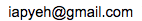

.. _h656466571196d4475805811267d637c:

virtualenv 的中文目錄問題
*************************

\ |IMG1|\ 如果你跟我一樣使用Python2.7，因為要安裝用virtualenv在中文目錄而發生UnicodeDecodeError的問題，你可以修改virtualenv.py來解決這個問題，virtualenv.py在site-packages下的virtualenv的egg檔案裡面。

.. _h174fb648377959437b5c1f697c1c40:

修改方式
========

在 1390行附近,找到這一行：

.. code:: 

    cmd = [py_executable, '-c', 'import sys;out=sys.stdout;',

修改成：

.. code:: 

    cmd = [py_executable, '-c', 'import sys;out=sys.stdout;reload(sys);sys.setdefaultencoding("utf-8");'

也就是說，加入以下這兩個命令在cmd的第三個項目中::

    reload(sys);sys.setdefaultencoding("utf-8");

.. _he29394a301c5848784936383d797953:

Symbol not found:
=================

另外一個MacOS的使用者，使用anaconda版本的python時可能會遇到__PyCodecInfo_GetIncrementalDecoder的問題：

\ |IMG2|\ 

假設執行這個命令::

    virtualenv test2env

會產生這個錯誤，雖然如此，依然會產生 test2env的目錄，test2env/bin 之下會有 python，但是沒有 pip, easy_install 等程式，而且::

    test2env/bin/python -c "import io"

會報錯。

這個問題的解決方式(假設 test2env)是複製系統的_io.so到建立失敗的目錄下的lib-dynload目錄。

.. code:: 

    cp /System/Library/Frameworks/Python.framework/Versions/2.7/lib/python2.7/lib-dynload/_io.so test2env/lib/python2.7/lib-dynload

執行這命令之後，再試著執行virtualenv建立其他虛擬環境，例如::

    virtualenv test3env

就會成功。 我是在MacOS Sierra (10.12.2)下測試的，對我有用。我不知道是否對於Windows有用，如果有人在其他OS下有用，歡迎來信告訴我\ |IMG3|\ 。

.. bottom of content

.. |IMG1| image:: static/VirtualenvProblem_1.png
   :height: 88 px
   :width: 697 px

.. |IMG2| image:: static/VirtualenvProblem_2.png
   :height: 28 px
   :width: 548 px

