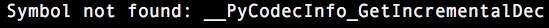

.. _h18252a246e166c5e2b455838275d773b:

在中文目錄建立virtualenv 的問題
*******************************

如果你使用MacOS Sierra (10.12.2)，要有中文的路徑中建立Python2.7 的Virtualenv，有跟我一樣的問題可以參考以下的方式，修改你的環境。

可能的問題有三個，你可以依序按照本文的說明逐步解決：

.. _h4261216e687d444f783965757f42270:

問題一：UnicodeDecodeError
==========================

\ |IMG1|\ ，因為要安裝用virtualenv在中文目錄而發生UnicodeDecodeError的問題，你可以修改virtualenv.py來解決這個問題，virtualenv.py在site-packages下的virtualenv的egg檔案裡面。

.. _h174fb648377959437b5c1f697c1c40:

修改方式
--------

在 1390行附近,找到這一行：

.. code:: 

    cmd = [py_executable, '-c', 'import sys;out=sys.stdout;',

修改成：

.. code:: 

    cmd = [py_executable, '-c', 'import sys;out=sys.stdout;reload(sys);sys.setdefaultencoding("utf-8");'

也就是說，加入以下這兩個命令在cmd的第三個項目中::

    reload(sys);sys.setdefaultencoding("utf-8");

.. _h52122b212b7f4222654705f10747a38:

問題二：Symbol not found:
=========================

另外一個MacOS的使用者，使用anaconda版本的python時可能會遇到__PyCodecInfo_GetIncrementalDecoder的問題，如果沒遇到這問題可以跳過本步驟：

\ |IMG2|\ 

假設執行這個命令::

    virtualenv test2env

會產生這個錯誤，雖然如此，依然會產生 test2env的目錄，test2env/bin 之下會有 python，但是沒有 pip, easy_install 等程式，而且::

    test2env/bin/python -c "import io"

會報錯。

這個問題的解決方式(假設 test2env)是複製系統的_io.so到建立失敗的目錄下的lib-dynload目錄。

.. code:: 

    cp /System/Library/Frameworks/Python.framework/Versions/2.7/lib/python2.7/lib-dynload/_io.so test2env/lib/python2.7/lib-dynload

執行這命令之後，再試著執行virtualenv建立其他虛擬環境，例如::

    virtualenv test3env

就會成功。

.. _h641d167d29241a7c4e6a2d4353173:

問題三：PIP SyntaxError: Non-ASCII character 
=============================================

如果你在virtualenv中要用pip安裝模組，像是這樣::

    $source pyenv/bin/activate

    (pyenv) pip install facebook

遇到SyntaxError的問題。你要修改pip，方法如下::

    #先找出你用的pip的位置

    $ which pip

然後編輯這個pip的第一行，例如本來是這樣

.. code-block:: python
    :linenos:

    #!/Users/you/某個中文目錄/pyenv/bin/python
    
    # -*- coding: utf-8 -*-
    import re
    import sys
    (略）

這個Syntax Error是因為第一行有中文字造成的，把第一行改成這樣

.. code-block:: python
    :linenos:

    #!/usr/bin/env python
    # -*- coding: utf-8 -*-
    import re
    import sys
    (略）

.. bottom of content

.. |IMG1| image:: static/VirtualenvProblem_1.png
   :height: 88 px
   :width: 697 px

