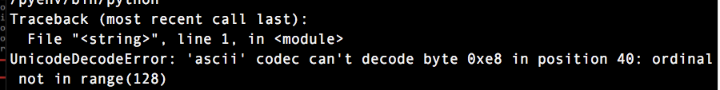

.. _h6743e2b5f78581a723a807a91d1c61:

Virtualenv 的中文目錄問題
*************************

\ |IMG1|\ 如果你跟我一樣使用Python2.7在使用virtualenv時，因為要安裝在中文目錄而發生UnicodeDecodeError的問題，你可以修改virtualenv.py來解決這個問題，virtualenv.py在site-packages下的virtualenv的egg檔案裡面。

有兩個地方要修改：

.. _h7e281c315350424ce913c23b17:

一、 
=====

在 753行附近, 找到以下這四行：

.. code:: 

    try:
        proc = subprocess.Popen(
            cmd, stderr=subprocess.STDOUT,
            stdin=None if stdin is None else subprocess.PIPE,

(1-fix) 修改方式是加入兩行在try之前，變成：

.. code:: 

    cmd.insert(1,'-c')
    cmd.insert(2,'"import sys;reload(sys);sys.setdefaultencoding(\\"utf-8\\")"')
    try:
        proc = subprocess.Popen(
        ...

.. _h1634483c7822441972316c7301545:

二、
====

在 1390行附近,有這一行：

.. code:: 

    cmd = [py_executable, '-c', 'import sys;out=sys.stdout;',

(2-fix) 修改成：

.. code:: 

    cmd = [py_executable, '-c', 'import sys;out=sys.stdout;reload(sys);sys.setdefaultencoding("utf-8");'

也就是說，加入這一段在第二個cmd的項目中：

reload(sys);sys.setdefaultencoding("utf-8");

我是在MacOS Sierra (10.12.2)下測試的，對我有用。我不知道是否對於Windows有用，如果有人在其他OS下有用，歡迎告訴我。

.. bottom of content

