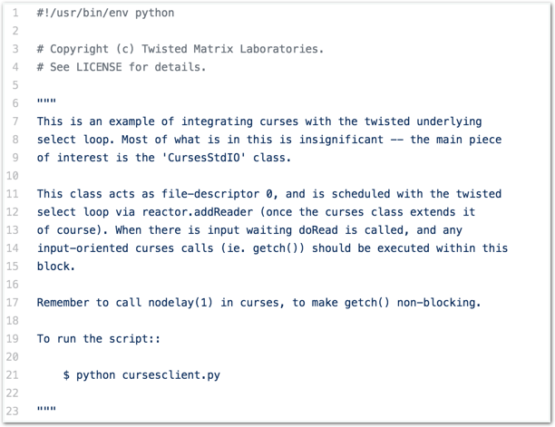
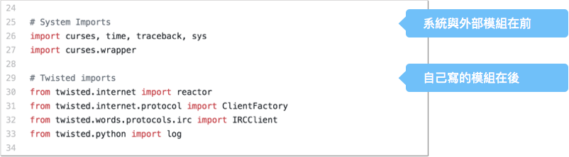
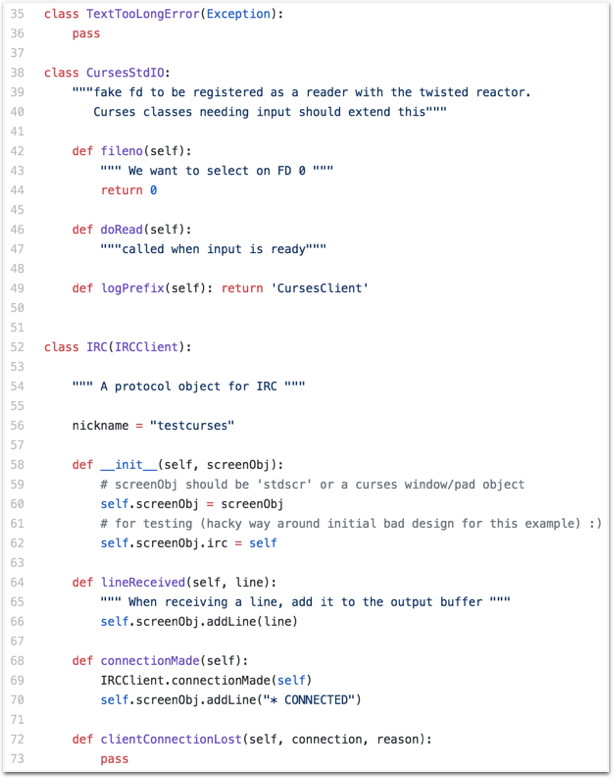
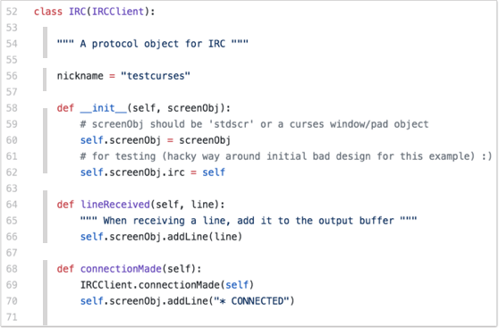
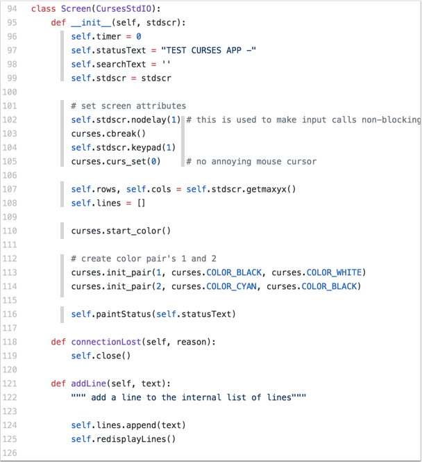
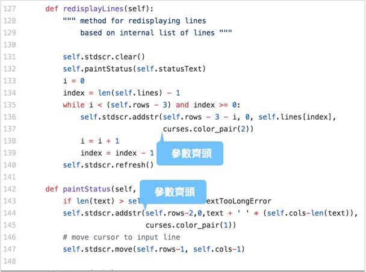
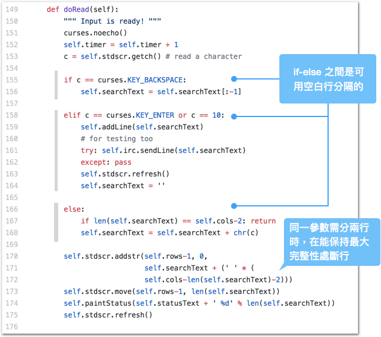
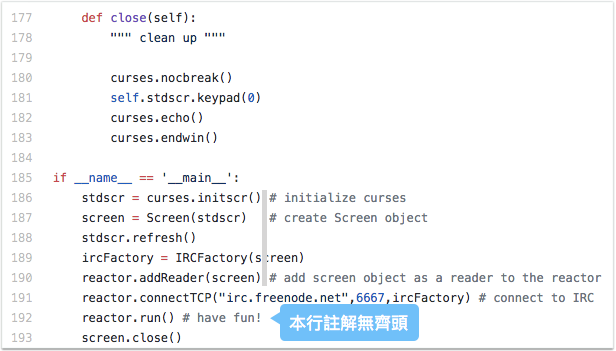

.. _h103c417c41302e48336a54306da4f10:

如何用空行讓Python更簡潔
########################

.. _h1634483c7822441972316c7301545:

前言
****

縮排是Python的特色，縮排讓Python程式碼簡潔易讀，很多人因此特性而喜愛Python。然而要讓程式碼的編排簡潔，只有縮排對齊是不夠的，空行也是重點。乍看之下，空行、換行、斷行簡單到不行，有什麼好談的呢？實際上正式因為太簡單反而沒做好的例子比比皆是。常聽人家說「世界上沒有簡單的事情只有簡單的頭腦」，空行這件事便是一例。

本文從 Twisted專案中挑出一個看起來簡潔的程式檔，學習其中關於空行、換行、斷行的使用時機。順便也稍微討論一些在此案例中出現的docstring。docstring是把程式的說明包含在原始碼中的一種機制，透過docstring可自動產生該程式的文件。很多Python教學文件把docstring「輕鬆帶過」，也許是因為那些文件是用在課堂上教學。然而在實務上docstring（aka Python文件）是一個很大而且甚至有點深奧的課題，尤其是Team work，或者是要參與網路上的專案，但是本文在此只稍微討論一部分出現在本案例中的docstring相關內容。

.. _h1634483c7822441972316c7301545:

本文
****

筆者挑選的是範例當中的IRC-client範例程式。因為範例程式不在API文件當中，它的docstrings會比較簡單些，可避免太多枝節而失去重點\ [#F1]_\ 。(\ |LINK1|\ )

\ |IMG1|\ 

* #3-4: 版權聲明只有兩行。第一行聲明Copy right holder，第二行請讀者去看另一份LICESE文件。這兩行是以#開頭，不是放在三引號(""")之中。跟很多open source的原始檔案比起來，這種方式顯得簡單扼要。

* #5:空一行

* #6-23: module docs 使用三引號("""), 

    * 第一段讓讀者明瞭這個script的目的與用途。(what and why)

    * 第二段說明這個script在整體系統中運作的要點(how it works)

    * 第三段是提醒使用者時要注意的事項

        * 有可能來自作者的猜測或事後的增補

    * 第四段是說明具體的使用方式(usage)

    * 每一段都空一行，即便只有一行。

    * 在 #19最後是兩個冒號 (::)，這會使下方的段落內縮。

    *  #21行顯示關於範例的格式開頭是 (內縮）$ （空白）python（空白)

    * 文字多的段落，例如前面兩段，每一行約以80個字元為限。

    * 並不是每一份script內都需要寫很多，如第一、二、三段，視情況而定。也有很簡單的，例如 \ |LINK2|\ 

\ |IMG2|\ 

* system imports、其他module的import 放前面，自己package的import放後面

\ |IMG3|\ 

從#35 -#73, 會看到幾種不一樣的風格。

* 我們來看兩個問題：

    * 是不是每一個class都要寫 class docs?

    * class docs 跟 class 宣告那一行之間要不要有一行空白？

* 這一段有三個class，第一個沒有class docs，第二個class有，但緊貼著class 定義那一行，第三個class也有，但與class宣告那一行之間有一行空白。也許寫這個script的工程師沒有嚴格遵守關於風格的規定，也許是根本就沒有規定。這兩種方式python都能正確解析出 class docs.

* 但是class docs跟下面的段落之間都有空白行。

* 然而，#42-45 的function docs 跟下面的段落之間並沒有空白行。

* #49 , def 宣告跟 return 寫在同一行。

* #58的 __init__,並沒有 docs，function docs並非每一個function都要寫。本段反而使用comment註解其下的程式行。

* #53跟#79都是一行內容，然而#79分成三行來寫。

* 一個class之內每一個區段之間都有空白行。區分 class docs、class property、及每一個method區塊。如下圖所示：

\ |IMG4|\ 

..  Hint:: 

    * 寫文件時「哪些要寫」無硬性規定，必要寫的時候才寫。何謂必要？這是大哉問。筆者建議有二：（一）別人有問的地方（二）過一陣子自己也會看不懂的地方。
    
    * 只要能被python解析為docstring即可，空行與否無強制規定。空白行是在python語法許可的前提下，可用來區隔不同意義的程式區塊。實際上，空白行也是那些文件自動產生器用來分辨區段段落是否結束的機制。

\ |IMG5|\ 

* 我們可以在#95-117之間看到，空白行在同一個function區塊之內被使用為不同意義區塊間的區隔。有些區塊只有一行(#110)，有些區塊有註解(#101)，因為是程式碼註解，此處使用的是comment(#)。#101註解的是該區塊，而#102後面的註解是註解該#102行的程式碼，會放到後面來推測是為了避免與#101的區塊性註解混淆的緣故。

* #102與#105的註解(#)是對齊的，使得畫面看起來更美觀。不知道是否有IDE自動做這件事，如果沒有顯然是出自重視美感的程式作者。

\ |IMG6|\ 

* #130的空白區隔開function docs跟以下的段落。

* #137的內容為上一行的延續，但自成一行避免內容跑出畫面外，而且後退到與#136的第一個參數對齊，看起來很清爽。

* #144與#145跟上面是類似的情況。但仔細看#144已經有三個參數，#145是第四個參數。可見，並沒有「一行一個參數」的原則，而是在可視範圍內盡量放，若放不下則移到下一行，並與上一行的參數齊頭。

\ |IMG7|\ 

* #154, #157,#165這三個空白行把一個if, elif, else分成三個區塊。清楚地暗示這三個區塊處理的是不一樣的情況。

* #170-#173，與上面#144與#145情況類似，但又有點不一樣。#171,#172是同一個參數。因為這個參數很長，#170放不下，如果單獨放在#171，與#170對齊之後也放不下，於是選擇把``self.cols-len(self.searchText)-2)``這一段「較為完整」的敘述放到第三行。

    * 另一種處理方式是在第一個參數就放到下一行，這樣可以爭取到更多的空間，例如在另一個程式中#222-#225：（\ |LINK3|\ ）

\ |IMG8|\ 

* #170在第一與第二參數間的逗點後面有一個空白，但是在#144前三個參數之間並沒有空白，如果回溯上面的程式碼會發現，有空白是常態，#144的情況比較特別，推測是為了把那三個參數放在同一行的緣故。

\ |IMG9|\ 

* #177-#193重點大置在前面已經出現過，值得觀察的是#186, #187, #190, #191, #192這幾行後面的註解。#186, #187, #190這三行有對齊，#191沒有對齊因為那一行剩下的空間不多，#192理論上應該要與上面四行對齊但是並沒有。我想這裡單純是一時手誤而已，但也意味著這些對齊的註解可能是作者手動製作的，而不是IDE完成的。

* #192是"have fun"，顯然這跟程式碼本身無關，而是一種幽默感。彷彿在跟讀者對話的意思。寫這些文件、註解或許不需要像寫論說文一樣中規中矩。

.. _h5c462122702e7cc06763134049d56:

運算符號前後的空格
==================

以本檔案為例，觀察到的現象是：

* 大部分的運算符號(operator)的前後都有格，例如 =（指定）, +（加）, \* （乘） ,  %（字串替換）

* \- （減）的前後反而是沒有空格比較多。

* = （等於）出現在函數呼叫的參數(keyword argument)中時，前後不放空格。

* 刮號()前後則完全不會出現空格。

.. _h5c462122702e7cc06763134049d56:

三引號與註解的差別
==================

三引號(""")跟註解(#)在python當中都有「文件」的用途，這兩者的差別是什麼呢？

* 包含在三引號(""")中的docstring是物件(class, method, attribute等) 的意義性說明。

* 而comment是用來做程式碼的說明，應用於單一行程式碼或多行程式碼的程式區塊。甚至像是設定性質的script完全只有comment，例如\ |LINK4|\ 。
* 

.. _h174fb648377959437b5c1f697c1c40:

背景說明
********

對於因AI而開始寫Python的人，Panda, Jupiter是重要的套件。而在「前AI時期」引導很多人進入Python領域的誘因則是Twisted與Zope，Twisted是Python老牌的async套件，很多人用來寫爬蟲的 Python3 asyncio，構想也是源自於Twisted\ [#F2]_\ 。Twisted目前仍是Python重要的套件，用途廣泛尤其是Networking的相關應用。

Twisted使用\ |LINK5|\ 為文件的markup語法 \ |LINK6|\ 。Epytext是早期從java借來的，屬於比較"古早"的格式，跟目前流行的\ |LINK7|\ \ [#F3]_\ 比起來，屬於輕量(light-weight)級的markup語法，\ |LINK8|\ )。而相當多的Epytext語法也被保留在reStructuredText當中

.. _h174fb648377959437b5c1f697c1c40:

版本沿革
********

* 2018年01月28初版，使用\ |LINK10|\ 從Google Docs轉成reStructuredText後發佈。

.. bottom of content

.. |LINK1| raw:: html

    <a href="https://github.com/twisted/twisted/blob/trunk/docs/words/examples/cursesclient.py" target="_blank">原始程式</a>

.. |LINK2| raw:: html

    <a href="https://github.com/twisted/twisted/blob/trunk/src/twisted/python/logfile.py" target="_blank">logfile.py</a>

.. |LINK3| raw:: html

    <a href="https://github.com/twisted/twisted/blob/trunk/src/twisted/application/app.py" target="_blank">出處</a>

.. |LINK4| raw:: html

    <a href="https://github.com/twisted/twisted/blob/trunk/docs/conf.py" target="_blank">conf.py</a>

.. |LINK5| raw:: html

    <a href="http://epydoc.sourceforge.net/manual-epytext.html" target="_blank">Epytext</a>

.. |LINK6| raw:: html

    <a href="http://epydoc.sourceforge.net/" target="_blank">Epydoc</a>

.. |LINK7| raw:: html

    <a href="https://www.python.org/dev/peps/pep-0287/" target="_blank">reStructuredText</a>

.. |LINK8| raw:: html

    <a href="http://daouzli.com/blog/docstring.html" target="_blank">進一步閱讀</a>

.. |LINK9| raw:: html

    <a href="https://github.com/twisted/pydoctor/" target="_blank">pydoctor</a>

.. |LINK10| raw:: html

    <a href="http://ggeditor.readthedocs.io/en/latest/" target="_blank">GGEditor</a>

.. rubric:: Footnotes

.. [#f1] 關於程式docstring的風格有好幾種，想深入瞭解的讀者可以參考 `這一則Stackoverflow <https://stackoverflow.com/questions/3898572/what-is-the-standard-python-docstring-format>`__ ，或者  `Google的Python程式風格指南 <http://tw-google-styleguide.readthedocs.io/en/latest/google-python-styleguide/index.html>`__ 
.. [#f2]  "asyncio was heavily inspired by Twisted" （ `出處 <http://asyncio.readthedocs.io/en/latest/twisted.html>`__ ）
.. [#f3]  關於使用reStructureedText (reST)製作Python文件，有興趣的讀者可參考「 `如何寫Python文件 <http://iapyeh.readthedocs.io/en/latest/blogs/technical/how2pydocs.html>`__ 」
.. [#f4]  reStructureedText的語法與Epytext的語法接近，如果docstring當中有L{x},C{x}這些markup者則是 Epytext。

.. |IMG8| image:: static/Python_原始碼風格_8.png
   :height: 202 px
   :width: 554 px

