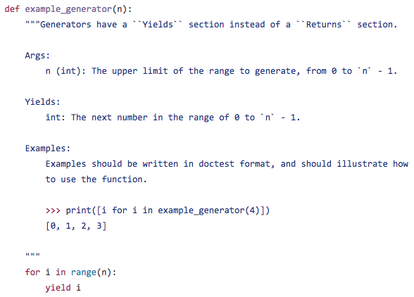
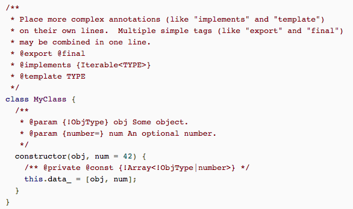
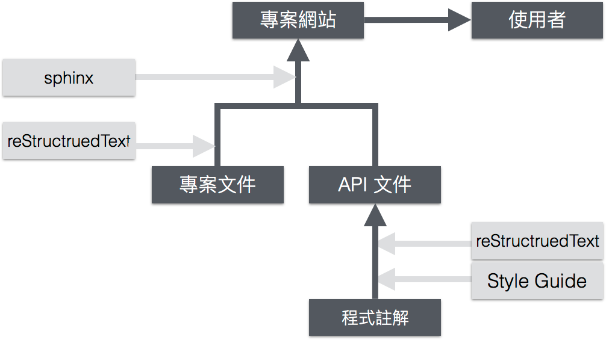
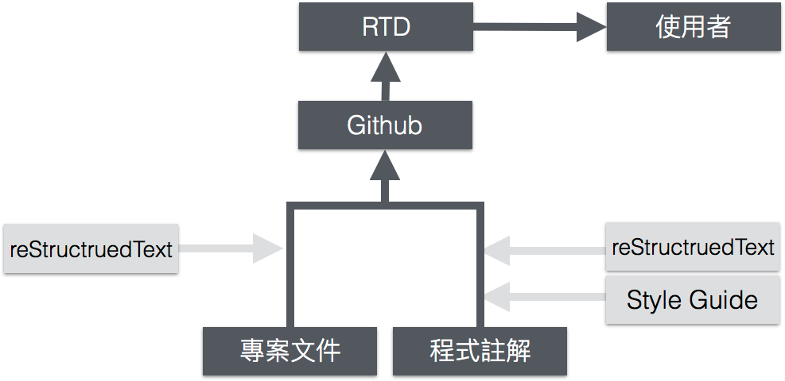
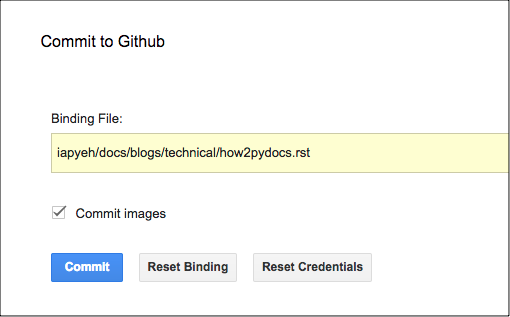
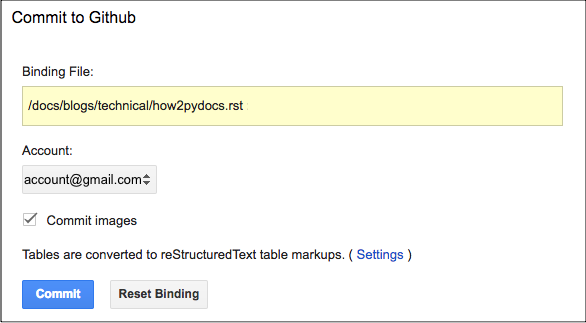
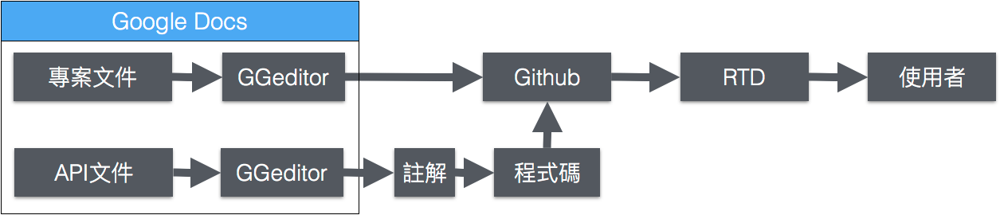

.. _ha4453f335a47156e62516a9564b36:

如何寫Python文件
****************

.. _bookmark-id-w1n8673l25vi:

.. _h1634483c7822441972316c7301545:

熱身
====

因為本文很長，本段先閒聊些關於寫文件的雜談作為開始，這一小段是熱身用途，如果你已經準備好了，略過不看無所謂，請直接看下一段的「\ |LINK1|\ 」。

寫文件是很多工程師的死穴，靠軟體吃飯的工程師多半是公司強制要求下勉強把寫註解當作寫文件，他可能可以熬夜寫程式，但要他寫文件不到十分鐘就不耐煩，甚至有些工程師會認為寫文件是一種低階的工作，要求他寫文件是對他的羞辱。然而，無論如何抵死不從，系統文件總是要有人寫。

把寫文件當成是一種低階工作這種幼稚觀念，近幾年來已經有所改變，儘管有些緩慢，但把寫程式跟寫文件聯繫在一起當成同一件事情的論述依然罕見，如果政府要推行「中小學生寫程式」大家都叫好，但如果是「中小學生寫文件」大概有人又要絕食了，但對於以寫程式糊口的工程師，這兩者是同一件事。好在，像是寫HTML, Javascript已經先脫離「低階工作」這一類別，而早年被視為「根本不是工程師該搞的」GUI則是鹹魚翻身，以UX的姿態重出江湖成為人人敬重的職務。

不過事情的發展似乎總是有進有退，像是幾家巨人大廠利用典範轉移成以行動網路為主流的時機，把Macromedia (Adobe) Flash幹掉，說它不夠安全又太耗電，然而目前為止這些巨人沒有一個能推出做得比Flash更好的替代品，甚至連個像樣的替代品都沒有。HTML5，CSS3，ECMAScript 6這些發展已經將近十年了，還是遠不如Flash好用。

寫文件這件事情似乎也發生同樣的返祖現象。筆者指的是Markdown這件事。用What You See Is What You Get的方式寫文件，是三十年前Window 3.1時代的MS Word就已經達到的成就，MS Word也造就了Bill Gates的微軟王國，至今MS Word依然制罷文書編輯無人能敵。現在竟然反過來要先學一種標注（Markup）語法寫文件，然後把螢幕一分為二，左邊寫右邊看會render成什麼樣子的方式寫文件，這事令筆者覺不可思議。我們用Word的時候是寫xdoc的XML再從Word的當中看到文件長什麼樣子嗎？並不是，而是在Word當中寫內容，再轉成xdoc的XML格式。那麼為何要用Markdown以古早時代的方式寫文件呢？當然，這只是筆者個人的牢騷罷了，也許復古的作法有其趣味吧。總之，發生在別人家裡面的事情，基本上不關自己的事情，人家高興就好。

但話說回來，寫文件畢竟還是挺折磨的，用Markdown寫的話只是雪上加霜而已。重點是，寫系統文件有沒有WYSIWYG的方式呢？有的！這篇文章要介紹大家認識另一種標注的語法，一個比Markdown更早、更完整且完全是從Python土生土長起來的，reStructuredText是也！

別誤會，筆者不是要大家以後不要寫Markdown改寫reStructuredText，要是如此就更返祖倒退了，因為 reStructuredText 比Markdown 嚴格，要徒手寫reStructuredText簡直是沒人性。筆者是認為，寫文件就是寫文件，不要再透過寫標注來寫文件，這樣才是正常的方式。所以，筆者在這篇文章也要介紹一個能把Google Docs轉成reStructuredText的工具，用Google Docs來寫文件，寫完後再轉成所需要的標注格式。用起來就跟寫Word存成PDF一樣。

除了寫文件的工具之外，本文內容還會介紹Hosting文件的網站。所以，這篇文章介紹給大家的是寫系統文件的Total Solution。雖然筆者覺得價格不應該是個賣點，但還是值得一提：本文介紹的是Solution剛好都是免費的。

.. _h1634483c7822441972316c7301545:

主旨
====

本文主旨在說明進行系統開發時如何製作一個\ |LINK2|\ 網站。本文適合的讀者是軟體工程師、研發部秘書、產品經理等與系統文件相關人員。本文內容不涉及系統文件有哪些段落、如何管理與審查、哪些條目與聲明版權聲明等內容與流程管理，也不涉及措詞、引用格式等風格問題。本文只專注於介紹程式碼及系統文件的格式、製作流程與工具，是一個工具性的HOW-TO文章。

開始之前，容筆者先替初學程式者與行外人釐清「寫程式」跟「寫系統」的概念，這兩者差很多可是經常被混為一談（這不能怪他們，因為他們畢竟是行外人，況且無法分辨這兩者差異的資訊相關科系教授大有人在呢）。在本文中「寫程式」意思是開一個文字檔輸入程式碼，「寫系統」意思是指寫程式完成某特定用途。因為系統可大可小（或許這就是造成語意模糊的地方），本文不以大小區別這兩者，一個系統可能只需要一個程式碼檔案，也可能需要數千個程式碼檔案、圖檔、音樂檔等等。只要程式碼不是用完就丟，而是有寫成文件需求的，都算是本文所說的系統。

本文的目的在說明如何替系統完成系統文件的製作。

.. _h1634483c7822441972316c7301545:

註解
====

程式語言幾乎都有註解（Comment）的語法。註解是夾在程式碼當中的一段文字描述。有的單獨成一行，有的與程式碼在同一行，有的橫跨數行成為一個區塊，這些註解不屬於程式運行的邏輯流程。Python的註解有兩種，一種是＃開頭，一種是前後三個雙引號包夾的區塊。註解的內容沒有限制，只要符合註解的語法，不會跟程式碼的其他邏輯部分混淆就可以，也可以說，註解是一塊讓工程師任意發揮的作文區。

基本上註解是寫給人看的，所以很多工程師以為寫註解就等於寫文件。其實，註解對於系統文件，就像英文單字一樣，只是構成文件的內容之一，系統文件包含註解，但比註解還要多很多。剛開始寫程式的初學者，還遇不到寫系統文件的要求，總會覺得註解沒什麼用途。事實上，註解是文件的重要基礎。看似無用的註解其實有大用。大用在於，註解也可以給機器看，「系統文件」便是機器去閱讀註解而自動建構起來的\ [#F1]_\ 。

.. _h1634483c7822441972316c7301545:

標注
====

所謂給機器看，就是讓另一個程式從程式碼中的註解產生一份文檔的意思。這種文檔，稱為API 文件（API Document）。這個轉換程式，姑且稱為「文件產生器」。API 文件的目的是讓讀者不必開啟程式碼就可以看到程式的功能、參數等資訊。

文件產生器無法從漫無格式的散文當中產生文件，寫註解必須遵守某些規則，文件產生器才能取出當中的資訊。遵守規則寫註解的行為稱為「標注」（Markup），該規則則稱為「標注語法」。

Google在他的Python\ |LINK3|\ （Google Python Style Guide）中，規定了標注語法的要求。標注語法不是程式語法只是一種風格，Python的知名的套件（程式庫）Numpy對於標注語法也訂了一份屬於它自己的風格（\ |LINK4|\ ）。

文件產生器會從標注中取出兩種訊息：

（A）標注格式：標注者希望呈現的樣貌、版型(layout)，例如粗體、斜體、超連結、圖片等。

（B）標注意義：關於註解內容的意義，例如函數名稱，參數名稱，類型等資訊，一般稱為後設資訊(metadata)。這些資訊會用來建構文件之間的結構、區分群組、產生選單與文件之間的連結，最終也會套用特定的版型，然後產生HTML。

標注者的義務是提供這兩種資訊給文件產生器，讓文件產生器得以正確運作。以下，讓我們更深入了解這兩種標注面向的內涵。

.. _h174fb648377959437b5c1f697c1c40:

標注格式
--------

Python的慣例使用reStructruedText作為標注格式。在台灣網路上比較容易接觸到的標注格式是 Markdown。如果你已經知道Markdown, 只要以相同的方式理解reStructruedText即可，這兩者的定位是一樣的。跟reStructruedText比以來，Markdown是一種比較具有彈性的標注格式，Github替你自動產生的README.md以及它的Gitbook使用的就是Markdown，台灣的Logdown網站是世界知名的部落格編輯網站，也是使用Markdown格式的標注。

粗略地講，reStructruedText的規定比較嚴格，它甚至像Python一樣對於內縮(indentation)有自閉的堅持，相對來講Markdown比較隨和些（彈性），Markdown最被稱讚的是它允許直接使用HTML\ [#F2]_\ 。彈性是一種雙面刃，在格式標注上的彈性會在意義標注上產生各自為政的情況

為什麼有HTML還要有其他的Markup呢？據說是因為HTML純是為了機讀而設計的，reStructruedText跟Markdown當初是為了能有一種兼具人與機器可讀的目的而產生。耐人尋味的是，據說Markdown受人歡迎的彈性是在它允許直接內含HTML。這可矛盾了，不是才說是因為不要HTML所以要有Markdown嗎？無論如何說來說去都無關緊要，反正各式各樣的標注語法也不止是這兩種而已，現實上就是這麼樣地存在著這些標注語法。

.. _h174fb648377959437b5c1f697c1c40:

標注意義
--------

標注意義主要常見在程式碼註解內，用於產生API文件，尤其是關於模組、物件、函數、參數的意義、用途、類型、待辦事項（TODO）的資訊。下圖是一個使用reStructuredText標注的範例：

\ |IMG1|\ 

此範例示範一個名稱為 example_generator的函式如何在註解中表達函式的功能、參數、參數的意義及回傳值。函式名稱會由文件產生器根據程式語言的語法自動識別，註解中的 Args:, Yields:, Examples: 是屬於意義標注，意義標注內容偶爾也會包含有格式標注，例如第二行的\`\`Yields\`\` 則是reStrcturedText的格式標注。你可以\ |LINK5|\ ，或者是這份\ |LINK6|\ 。

.. _bookmark-id-s4syqf18lhw3:

.. _h572187820253c7294643631303029:

文件產生器
----------

「標注意義」跟「標注格式」是要相對於文件產生器而言才有意義，上面的案例使用的是Sphinx這個文件產生器。也就說，如果你根據事先約定好的規則寫好標注之後丟給Sphinx處理，Sphinx就會產生你所預期的結果。

為了讓你更了解這個概念，請看以下這個範例：

\ |IMG2|\ 

這是一個在javascript程式碼當中，為JSDocs文件產生器而標注的註解。函式的參數是用＠param標注，而上面的Python案例中則使用Args:逐行標記。這個案例取自\ |LINK7|\ 。兩者標注的差異並不是Javascript與Python的語言差異，而是因為這份文件的目的是為了能用JSDoc文件產生器從程式碼產生API文件。換言之，如果你將來預備讓Sphinx替你的javascript產生文件，你也可以在Javascript程式碼當中使用Sphinx可以接受的標注方式，然後由Sphinx產生Javascript的API文件\ [#F4]_\ 。

..  Note:: 

    如果把Sphinx處理API文件的過程說的更詳細一點，關於意義標注的風格，並不是由Sphinx的核心功能直接處理的，而是由擴充功能先作前處理，把這些註解內容轉換成reStructuredText相對應的標注，然後再由Sphinx作處理，這種流程設計可以讓Sphinx的核心單純化也更彈性化\ [#F5]_\ 。

.. _h2164242e4c6048506f23311549231654:

如何寫文件？
============

有上述的基礎概念之後，現在你應該已經了解「如何寫文件的問題」也就等同於「選擇哪一種文件產生器」的問題。一旦決定了使用哪一種文件產生器，只需根據該文件產生器的規定寫文件\ [#F6]_\ 就是了。以Python而言，目前主流是前面提到的Sphinx。如果你去Google 「python document generator」會發現還有其他的文件產生器，例如老牌的pydoc，但為何Sphinx能制霸這個領域呢

因為，系統文件不是只有「API文件」，還有「專案文件」。「專案文件」是什麼呢？假如你請工程師去研究一下，要辨識圖像用哪個Open Source的SDK比較好，工程師通常會回報說「A比較強可是文件少，B比較弱可是文件多」，他所說的「文件」就是所謂的「專案文件」。「專案文件」這個概念我們在網路看得多但談的少，少到連名字都還沒共識，也許「專案文件」對你有別的意義。但是在本文中，凡是「非API的文件」，亦即那些不是用來說明你的程式有哪些模組、有哪些函數呼叫的文件，本文都稱之為專案文件。

例如\ |LINK8|\ 網站上有一個「首頁」說明GGeditor 是什麼、有什麼特性，還有其他為了讓使用者了解如何使用GGeditor 的Tutorial（導引）, User Guide（使用手冊）, How To（如何）, Examples（範例）等等都不是API文件，而是GGeditor 的「專案文件」。GGeditor只是一個小工具，大型系統的專案文件是多如牛毛，而且經常需要改版再改版，不只文字跟圖案，甚至還有影音。通常咱們台灣的程式設計師十八般武藝都要會一手，不只要寫程式跟寫API文件，還要負責撰寫這些專案文件，在人力充沛的開發團隊也許會有PM或秘書負責，然而，不論是誰負責，系統文件包括專案跟API文件這兩種是不變的。

這些專案文件該怎麼寫沒有強制規定或國際標準可以遵循，既然最終是用網頁呈現，你直接寫HTML也行。然而，慢慢地你會發現，只有HTML是不夠的，還要有PDF才行，否則讀者要把整份文件列印下來還挺麻煩的。到頭來終究會認識到：如果可以只寫一份，然後由那一份去產生其他的格式，是一種比較好的作法。

這時候，Sphinx跟reStructuredText就可以出場了，你用reStructruedText的格式寫一份，然後由Sphinx轉成HTML、PDF、LaTex等各種格式。如此一來，不論是API文件還是專案文件，都用reStructruedText的格式寫註解，都用Sphinx作轉換，寫系統文件只要這一套組合就可以完成，這是經濟實惠的作法。

以上所談論的觀念可以總結為以下的圖形表示。

\ |IMG3|\ 

到此，你應該已經了解要寫Python的文件，你必須學會兩件事：

#. reStructuredText的格式要怎麼寫。

#. 如果你負責寫程式的話，還要知道Style Guide的規則是什麼。

如果研發團隊能作做到這兩件事情，剩下的就是Sphinx的事了。

..  Tip:: 

    如果你使用IDE作開發，你的IDE可能有協助使用者使用某些特定風格（規格）寫API文件的功能，可以為你省下不少心力。但身為工程師，你需知道IDE提供給你的風格是哪一種，適用於哪一個文件產生器，並讓團隊成員使用相同的風格，避免將來產生轉檔失敗，必須重寫的問題。

.. _h2164242e4c6048506f23311549231654:

文件放哪裡？
============

But ! 一旦你開始動手之後，你會發現事情沒那麼簡單。

Sphinx只是一個應用程式，要有人知道如何安裝、執行與使用，還要架一個網站把它產生的HTML檔案及附圖放上去。Sphinx只要用pip安裝即可，比較大的困擾是，如果不是資源豐沛的公司，要架設網站是挺耗時費力的，頻寬、網址申請、VM管理還有惱人的資安問題要有對策。

沒問題！ \ |LINK9|\  (RTD)跟Github可以幫你搞定。

你把文件commit到Github去，RTD的後台就可以從你的Github repository中用Sphinx產生你的系統文件，而且還能全文檢索。也就是說，RTD是一個hosting技術文件的網站。它是免費的\ [#F8]_\ 。使RTD跟Github之後，製作文件的流程架構會是這樣：

\ |IMG4|\ 

..  Note:: 

    在Github中，檔名以.rst結尾的reStructruedText檔案只能部分性的顯示，所以你在Github看到的.rst檔案內容會有點怪異，讀起來好像很多奇怪的符號，圖形大小也有點不協調。那是正常的現象。

要commit什麼文件呢？就是上面提到的兩種：

第一、API文件的部分，commit原始程式碼。

第二、專案文件的部分，commit reStructuredText格式的文字檔。

關於API文件，因為Sphinx是從 Python程式中產生文件，你要commit的是 Python script。那些程式碼可以自由選擇遵守Google或NumPy制定的註解風格，這兩者風格Sphinx都支持。你可以不提供程式碼內關於運算邏輯的部分，只提供程式碼的註解部分，換言之，只提供interface性質的檔案是可以的。要注意的是，如果你要讓RTD產生API文件，要在RTD的設定檔(conf.py)中宣告，細節可參考GGeditor提供的\ |LINK10|\ 。

至於專案文件，你只需寫成reStructuredText格式就行了，是的「只」需要寫成reStructuredText格式，真的「只」需要寫成reStructuredText格式！

.. _ha50657a67374f257533a67c68622:

reStructuredText
================

上面已經介紹完背景知識跟文件放那裡的問題。現在可以來直接面對核心的問題，也就是reStructuredText。產生reStructuredText是寫文件這件事情的最後關鍵，因為hosting、轉換等等例行公事全部都有工具跟免費的資源可以幫助你，系統是你的，程式碼是你寫的，只有你自己知道要寫什麼內容，這些內容當然是你，肯定也是你要生出來，就等你把reStructuredText的文件生出來了，這最後一哩就打通了。那麼 reStructuredText長得什麼樣子呢？

因為本文並不是要作reStructuredText的教學，在此僅提供以下幾份相關文件給您參考：

* reStructuredText是Docutils專案下發展出來的，\ |LINK11|\ 。

* 如果覺得讀上面的規格很煩，可以看這一份濃縮版 \ |LINK12|\ 。

* A ReStructuredText Primer的\ |LINK13|\ ，你可以看看reStructruedText長什麼樣子。

* 如果上面的濃縮版還是很難讀，這裡還有\ |LINK14|\ 

* 最完整的資訊在\ |LINK15|\ 

.. _hd1b83d48586e1b393a624e28544946:

練習題
------

在繼續往下讀之前，筆者我建議你實際動手寫看看reStructruedText。有一個很棒的網站，可以實際體會寫reStructuredText的快感！\ |LINK16|\ ，以下是一個小作業，你可以當作練習。

.. admonition:: 練習題

    下圖有三句話，請在\ |LINK17|\ 上用reStructuredText寫看看。\ |IMG5|\ 這三句話中包含一個單行的段落以及兩個清單項目(list item)，清單項目包含純文字以及超連結。

（筆者在這裡先暫停一個禮拜等你完成練習題）\ |IMG6|\ 

.. _h174fb648377959437b5c1f697c1c40:

習題解答
--------

這位同學，我希望你是功課寫完之後才來看解答，但我猜你一定沒寫就直接跳看解答。如果是這樣的話，恭喜，你的進度已經超前那些還在寫作業的同學一個禮拜以上。事實上，如果同學你從零開始，根據網路上的reStructuredText資料一個禮拜內完成習題的話，你這位天才請接受筆者一拜\ |IMG7|\ 。

因為本文是用reStructuredText發佈在 RTD上的，\ |LINK18|\ ，參考的答案在裡面。不論你有沒有做功課，請點選連結打開來，用五秒鐘的時間捲動看一看，想一想，你可以用什麼工具把你的使用手冊等等系統文件用reStructuredText寫出來。

如果你正在想「筆記本、Notepad++、Sublime、Atom、VIM哪一個比較好」，再多告訴你一點關於用reStructuredText寫表格的語法。以下這個表格：

+------+------+
|標題列|標題列|
+======+======+
|HELLO |WORLD |
+------+------+

它的reStructuredText原始碼在此：

.. code-block:: python
    :linenos:

    +---------+---------+
    |標題列   |標題列   |
    +=========+=========+
    |HELLO    |WORLD    |
    +---------+---------+

建議你貼到線上體驗版上去玩一玩，請注意，第二行的中文字不整齊不是錯誤，是它該當如此。

現在你心中對於「筆記本、Notepad++、Sublime、Atom、VIM哪一個比較好」的答案是什麼呢？

.. _h28105e656d4d48041184d771d3b4a1a:

GGeditor
========

如果你認真寫過練習題，相信你已經透徹了解用reStructuredText寫文件那種彷彿每根手指骨折裹著石膏的沈重感，你本來想要開始寫文件，現在可能開始想寫辭呈。要寫reStructuredText，上面提到的那些文字編輯器都是一樣的令人感到遺憾。既然你能把這篇長文看到這裡，相信你真心想把寫文件這個功力練好。所以筆者在此介紹一個工具給你，至少可以節省你一個月以上的時間，一個不必懂reStructuredText就可以完成系統文件的工具：GGeditor。

GGeditor是Google Docs的Add-on，它從Google Docs文件產生reStructuredText格式的檔案，你在Google Docs裡面寫文章、寫條列項目、畫表格、貼圖、註腳，然後GGeditor把它轉成reStructuredText。你可以完全不懂reStructuredText。

而且GGeditor不只是一個reStructuredText的轉換器而已，它還能把產生的reStructuredText檔案Commit到Github。然後你在RTD的網站就自動更新了。

GGeditor選擇以Google Docs Add-on的方式開發，是因為用Google Docs寫文件有很多好處：

#. Google Docs的協同作業、多人同時編輯、統計圖等功能也都可以利用。

#. Google Docs有很多Add-on可以用，如果你要寫英文文件，Google Docs有拼字檢查，還有作英文Proof-Reading的Add-on可以使用，資源豐富。反觀Gitbook只能寫Markup，而Markup無法作拼字跟文法檢查，所以使用Google Docs寫文件是一種比較好的選擇。

#. 不需要學習Markup語法，就可以立刻上手。寫作的時候不會產生好不容易寫完懶得再修改的問題，可以鼓勵工程師邊做邊寫。

使用GGeditor可以：

* 將段落、連結、表格、項目清單、圖形、註腳直接轉成reStructruedText。

* 在文件中呈現Admonition，Directive等模擬區塊，不必記憶reStructruedText的語法。

* 直接Commit到Github。

下圖為GGeditor插入各種Admonition的選取畫面。Admonition就是「警告」、「提示」之類用於特別提示的方塊文字區。

\ |IMG8|\ 

下圖使用GGeditor直接把產生的reStructuredText Commit到Github的操作畫面

\ |IMG9|\ 

GGeditor還有一個用途是它可以同時用來產生專案文件與API文件。由於API的說明存在程式註解中，產生API文件的方式並不是用Google Docs編輯程式碼，而是利用GGeditor產生reStructruedText，然後把產生的內容貼到程式碼中。這聽起來好像有點麻煩，但操作起來一點也不麻煩，只要抱著使用Word產生PDF的相同心態來使用就是了。專業的軟體工程師要有「邊寫程式邊寫文件」的好習慣，只要把函式說明各自放在一個1x1的表格（Table）中，當游標被放在表格裡面時，GGeditor只轉換該表格的內容，再把轉換的內容複製貼到文字編輯器中就可以。GGeditor在複製時會將每一行內容自動加上#成為註解。

\ |IMG10|\ 

這是\ |LINK19|\ ，以及\ |LINK20|\ 。如果你是RTD的初學者，GGeditor的網站上有How To文件引導你\ |LINK21|\ ，讓你的RTD文件網站跟Github可以連動。文件網站上也有How To文件，引導你\ |LINK22|\ ，讓你只要把程式碼Commit到Github，你在RTD的API文件也就自動完成更新。

.. _h1634483c7822441972316c7301545:

總結
====

專業的Python文件是用下圖所示的方法完成的。這張圖把reStructuredText，Sphinx都隱藏起來了，因為透過這一個程序，就可以完成你的系統文件，你不需要知道這些技術細節，只需要知道背後有他們的功勞就可以。筆者覺得「專注於內容」，不需要管什麼標注不標注的，才是寫文件的正常方式，推薦給您這一套Total Solution。

\ |IMG11|\ 

附註一：這篇長篇大論，當然不是用reStructuredText雕刻出來的，而是用GGeditor轉換的，\ |LINK23|\ 。

附註二：從2017年1月15日起，GGeditor的新版本支持把表格轉成HTML的功能，表格的rowspan, colspan，顏色都可以更精準的轉換到RTD的網頁上。

.. bottom of content

.. |LINK1| raw:: html

    <a href="#bookmark-id-w1n8673l25vi">主旨</a>

.. |LINK2| raw:: html

    <a href="http://ggeditor.readthedocs.io/en/latest/index.html" target="_blank">像GGeditor這樣的文件</a>

.. |LINK3| raw:: html

    <a href="http://google.github.io/styleguide/pyguide.html" target="_blank">程式碼風格指南</a>

.. |LINK4| raw:: html

    <a href="http://sphinxcontrib-napoleon.readthedocs.io/en/latest/example_numpy.html" target="_blank">Numpy的規則</a>

.. |LINK5| raw:: html

    <a href="https://github.com/iapyeh/GGeditor/blob/master/backend/apidocsample.py" target="_blank">按這裡看完整的示範程式檔</a>

.. |LINK6| raw:: html

    <a href="http://docutils.sourceforge.net/docutils/statemachine.py" target="_blank">官方版的示範程式檔</a>

.. |LINK7| raw:: html

    <a href="http://google.github.io/styleguide/jsguide.html#jsdoc-tags" target="_blank">Google Javascript 風格指南（Google Javascript Style Guide）</a>

.. |LINK8| raw:: html

    <a href="http://ggeditor.readthedocs.io/en/latest/index.html" target="_blank">GGeditor的文件</a>

.. |LINK9| raw:: html

    <a href="https://readthedocs.org" target="_blank">readthedocs.org</a>

.. |LINK10| raw:: html

    <a href="http://ggeditor.readthedocs.io/en/latest/ApiDoc.html" target="_blank">How to Create API Docs</a>

.. |LINK11| raw:: html

    <a href="http://docutils.sourceforge.net/docs/ref/rst/restructuredtext.html" target="_blank">標準規格文件在此</a>

.. |LINK12| raw:: html

    <a href="http://docutils.sourceforge.net/docs/user/rst/quickstart.html" target="_blank">A ReStructuredText Primer</a>

.. |LINK13| raw:: html

    <a href="http://docutils.sourceforge.net/docs/user/rst/quickstart.txt" target="_blank">原始reStructuredText檔</a>

.. |LINK14| raw:: html

    <a href="http://docutils.sourceforge.net/docs/user/rst/cheatsheet.txt" target="_blank">單張版</a>

.. |LINK15| raw:: html

    <a href="http://docutils.sourceforge.net/rst.html" target="_blank">官方網頁</a>

.. |LINK16| raw:: html

    <a href="http://rst.ninjs.org/" target="_blank">請點這裡開啟線上體驗</a>

.. |LINK17| raw:: html

    <a href="http://rst.ninjs.org/" target="_blank">線上體驗版</a>

.. |LINK18| raw:: html

    <a href="https://raw.githubusercontent.com/iapyeh/iapyeh/master/docs/blogs/technical/how2pydocs.rst" target="_blank">這是本文的reStructruedText檔</a>

.. |LINK19| raw:: html

    <a href="https://chrome.google.com/webstore/detail/ggeditor/piedgdbcihbejidgkpabjhppneghbcnp" target="_blank">GGeditor的安裝網頁</a>

.. |LINK20| raw:: html

    <a href="http://ggeditor.readthedocs.io/en/latest/index.html" target="_blank">GGeditor的文件網站</a>

.. |LINK21| raw:: html

    <a href="http://ggeditor.readthedocs.io/en/latest/how2Readthedocs.html" target="_blank">如何完成RTD要求的Github設定</a>

.. |LINK22| raw:: html

    <a href="http://ggeditor.readthedocs.io/en/latest/ApiDoc.html" target="_blank">如何設定你的API文件</a>

.. |LINK23| raw:: html

    <a href="https://docs.google.com/document/d/1z67wTux_78RNeA6Mkl2MPyD68h1oX70lv_UY7-B_WiA/edit?usp=sharing" target="_blank">這裡是Google Docs的原始文件</a>

.. rubric:: Footnotes

.. [#f1]  有些編譯器也利用註解標注變數型別進行效能優化。
.. [#f2]  reStructuredText也可以用HTML，但不是「直接使用」而是包在一個特定的格式內。
.. [#f3]  因為這種情況而有了Commondown
.. [#f4]  AutoJs -  https://github.com/lunant/sphinxcontrib-autojs
.. [#f5]  sphinxcontrib-napoleon - https://pypi.python.org/pypi/sphinxcontrib-napoleon
.. [#f6]  這句話有語病。萬不得已的情況下，當然也可以作markup格式之間的轉換。
.. [#f7]  不說sphinx最好是怕阻礙了其他頗為創新的方式，詳見 http://stackoverflow.com/questions/1125970/python-documentation-generator
.. [#f8]  Hosting的部分主要是由佛心來的 `Rockspace <https://www.rackspace.com>`__ 買單。

.. |IMG5| image:: static/how2pydocs_5.png
   :height: 88 px
   :width: 681 px

.. |IMG7| image:: static/how2pydocs_7.png
   :height: 40 px
   :width: 53 px

.. |IMG10| image:: static/how2pydocs_10.png
   :height: 277 px
   :width: 697 px

