.. _h2c53576b40f4a51263b738134a6d:

Database Processing in Parallel with Python3
********************************************

Python2 本有multiprocesses, multithread兩種平行運算的類型,在Python3的標準函式庫中又加入一個asyncio，關於這三者是什麼涵義，網路上已經很多的文章，此處不再贅言。本文的主旨是想藉由一個實際案例讓讀者可以更深入了解這三者的區別與適當的使用時機。

.. _hd1b83d48586e1b393a624e28544946:

案例：
======

有一個MySQL資料庫內有12張個人資料表，相同的schema，希望能找出distinct的records，並以10000人為一組輸入為檔案。目標是以Python的平行運算功能完成一個速度最快的程式。

.. _h572187820253c7294643631303029:

執行環境：
----------

+------------------+--------------------------------------+
|                  |                                      |
+------------------+--------------------------------------+
|HW                |CPU：                                 |
|                  |                                      |
|MacPro            |RAM：                                 |
+------------------+--------------------------------------+
|SW                |OS: MacOS 10.12                       |
|                  |                                      |
|                  |RDBMS: MySQL Community Edition version|
|                  |                                      |
+------------------+--------------------------------------+
|各年資料表及紀錄數|ID2000: 2,324,798 records             |
|                  |                                      |
|                  |ID2001: 0 records                     |
|                  |                                      |
|                  |ID2002: 2,876,945 records             |
|                  |                                      |
|                  |ID2003: 964,940 records               |
|                  |                                      |
|                  |ID2004: 963,719 records               |
|                  |                                      |
|                  |ID2005: 1,011,473 records             |
|                  |                                      |
|                  |ID2006: 1,004,483 records             |
|                  |                                      |
|                  |ID2007: 997,491 records               |
|                  |                                      |
|                  |ID2008: 996,222 records               |
|                  |                                      |
|                  |ID2009: 991,508 records               |
|                  |                                      |
|                  |ID2010: 989,194 records               |
|                  |                                      |
|                  |ID2011: 988,304 records               |
|                  |                                      |
|                  |ID2012: 987,513 records               |
+------------------+--------------------------------------+

.. _h6a2981732743d1b12463a152e26545c:

Schema:
-------

資料庫名稱是LHID2005，以下為ID2000-ID2012的Schema。 HASHIDV是ID+ID_BIRTHDAY的HASH值，所以，只要HASHIDV相同，便視為相同的紀錄。

\ |IMG1|\ 

.. _h6c68b7fc3322104970635469471848:

Script 01 - 建立優化程序的基準參考點
====================================

.. code-block:: python
    :linenos:

    #!/usr/bin/env python3
    import pymysql
    import time, pickle
    #
    # 建立資料庫連線
    #
    conn = pymysql.connect(
        host='127.0.0.1',
        user='user',
        passwd='passwd',
        db='LHID2005',
        cursorclass=pymysql.cursors.Cursor
        )
    cur = conn.cursor()
    
    #
    # 間單輸出並計算已經耗時多久
    #
    start_time = time.time()
    def tell(topic):
        print ('%s\t%s' % (time.time()-start_time,topic))
    
    #
    # 用來放置取得的紀錄，並將每10000筆distinct的紀錄pickle成檔案。
    # 因為下一步處理是批次進行的，這些檔案將作為批次檔案的輸入檔。
    #
    class Persons(object):
        def __init__(self):
            # 暫存紀錄用途，累積10000筆之後一次輸出成檔案
            self.current_batch = []
            self.current_batch_size = 0
            self.current_batch_idx = 0
            self.batch_size = 10000
            # cache用途，檢查是否為已經重複的紀錄時使用
            self.hashidv = {}
    
        def add_person(self,entry_dict):
            try:
                self.hashidv[entry_dict['HASHIDV']]
                return
            except KeyError:
                pass
            # 新紀錄
            self.hashidv[entry_dict['HASHIDV']] = 1
            self.current_batch.append(entry_dict)
            self.current_batch_size += 1
            if self.current_batch_size >= self.batch_size:
                self.pack_batch()
                self.current_batch = []
                self.current_batch_size = 0
                self.current_batch_idx += self.batch_size
    
        def pack_batch(self):
            if len(self.current_batch)==0: return
            #
            # 已知最終紀錄數量約為100萬，所以前置零的數量取7
            #
            s = str(self.current_batch_idx+1).zfill(7)
            e = str(self.current_batch_idx+len(self.current_batch)).zfill(7)
            path = 'batches/person-%s-%s' % (s,e)
            fd = open(path,'wb')
            pickle.dump(self.current_batch,fd)
            fd.close()
            tell(path)
    
    #
    # 從資料庫讀入某一年的紀錄
    #
    def getIDFromYear(persons,year):
        tell('running year %s' % year)
        fields = 'ID,ID_BIRTHDAY,ID_SEX,HASHIDV'.split(',')
        sql = 'select %s from ID%s' % (','.join(fields),year)
        tell('sql: %s' % sql)
        cur.execute(sql)
        tell('execution completed')
        for r in cur:
            entry = {}
            for idx,field in enumerate(fields):
                entry[field] = r[idx]
            persons.add_person(entry)
        tell('finish %s' % year)
    
    if __name__ == '__main__':
    
        persons = Persons()
    
        years = [2000, 2002, 2003, 2004, 2005, 2006, 2007, 2008, 2009, 2010, 2011, 2012]
        for year in years:
            getIDFromYear(persons,year)
    
        #
        # 不足10000筆的也要輸出
        #
        persons.pack_batch()
    
        tell('total:%s' % len(persons.hashidv))
    
        cur.close()
        conn.close()

執行畫面如下：（略圖）

\ |IMG2|\ 

從上圖可知，對ID2000的查詢約是花費50秒。最終的畫面如下：

\ |IMG3|\ 

從上圖可知，2012年的已經沒有新的紀錄或新紀錄的數量已經不足10000，因此沒有檔案輸出，全部執行時間是376秒，總共筆數是 1,001,413筆。這兩個數字將作為我們優化執行速度的起點與基準。以後的程式修改後都必須最終取得相同筆數才是正確的。

.. _h6e203e6732eb44716361466955645b:

Script 02 - 換不同的MySQL Package
=================================

Python3 至少有三種存取MySQL的函式庫，pymysql是pure Python實作的，安裝最簡單，但是速度想當然也是最慢的，因為我們的OS可以安裝其他模組，所以我們對Script 01的優化先從更換Package開始。Script 02先換成使用C加持pymysql而產生的cymysql，用pip安裝完cymysql之後，只要把pymysql換成cymysql即可：

.. code:: 

    import cymysql
    import time, pickle
    #
    # 建立資料庫連線
    #
    conn = cymysql.connect(
        host='127.0.0.1',
        ...
        cursorclass=cymysql.cursors.Cursor

以下是執行結果：

\ |IMG4|\ 

數量是最對的，但執行時間只要169秒。

.. _h573d3868627850641b6bd6b362410:

Script 03 - 使用 MySQLdb
========================

在Script 03，我們再測試第三個Package，這次我們換成在Python2就已經存在的MySQLdb。

.. code:: 

    import MySQLdb
    import time, pickle
    #
    # 建立資料庫連線
    #
    conn = cymysql.connect(
        host='127.0.0.1',
        ...
        cursorclass=MySQLdb.cursors.Cursor
    ...

執行結果如下：

\ |IMG5|\ 

數量一致，執行時間已經縮短到83秒。結果很清楚，在我們的平台上，MySQLdb是最好的選擇。

..  Hint:: 

    不同函式庫存取資料庫的效能有很大的差異，不論你是要存取MySQL, PostSQL, 還是ODBC，哪一種函式庫在你的環境上有最好的效能是值得一試的。

.. _h155c57a7871a84f3f4abe78623d:

Script 04 - Cursor vs. SSCursor
===============================

資料庫函式有好幾種Cursor，一種是預設的一般的Cursor，還有一種比較少出現在sample code當中的SSCursor。SS是Server-Side的意思，一般的Cursor是把查詢到的資料一次全部都抓回來，SSCursor是用到時才到資料庫Server上抓回來。我們來測試一下，以我們的案例而言，哪一種比較快。只要修改cursorclass即可。

.. code:: 

    import MySQLdb
    import time, pickle
    #
    # 建立資料庫連線
    #
    conn = cymysql.connect(
        host='127.0.0.1',
        ...
        cursorclass=MySQLdb.cursors.SSCursor
    
    ...

執行結果如下：

\ |IMG6|\ 

時間退回到113秒跟83秒有顯著的差異。可見以這個案例，選擇一般的Cursor，也就是client side cursor效能比較好。推測是因為資料庫在localhost，而且我們是一次就使用全部的資料，這使得SSCursor的方式並沒有獲得效益，反而被它的overhead拖累。以下的測試，將退回到Script 03的版本，使用一般的Cursor。

..  Hint:: 

    SSCursor在對本案例的效益是負的，未必表示對其他案例也是負的。在優化時要試一試這兩種的效能差異，尤其是透過網路存取資料庫時。

.. _h768394e1f442a3129b3e204d5e3853:

Script 05 - Overhead of wiriting file
=====================================

接下來我們想了解輸出pickle檔案對程式效能影響有多大，畢竟本案例輸出一百萬筆資料。我們先停止Script 03的輸出部分，此為Script 05。作法是把 #63-#65 comment-out。

\ |IMG7|\ 

執行結果如下：

\ |IMG8|\ 

執行時間約是80秒。跟Script 03相比，多了約4秒。比例很低，因此pickle與寫檔案的部分不是優化重點。不過為了降低檔案系統在測試過程中的負擔，我們以下的測試也將不再輸出檔案。我們同時觀察記憶體的使用量如下：

\ |IMG9|\ 

.. _h7d5b5b6c7f5c571748285c26665168:

Script 05 - Iterating entries
=============================

我們還需要檢驗，iterating 所查詢到的資料紀錄的方式是否是最有效率的方式。目前為止，我們使用的都是這一種方式：

\ |IMG10|\ 

還有一種使用fetchone的寫法：

\ |IMG11|\ 

這一種的執行效能如何呢？以下是執行的結果：

\ |IMG12|\ 

竟然多了13秒。

Script 05 - SSCursor

然而，如果fetchone的方式搭配SSCursor的話，會不會反而比較快呢？以下是執行結果：

\ |IMG13|\ 

可見得並沒有，SSCursor還是比較慢。所以我們將繼續使用原有的iterating與一般的Cursor的方式。

值得一提的是，使用SSCursor時，記憶體的用量只有原本的10％。

\ |IMG14|\ 

.. _h4c7d131e101186041311869414d5966:

Script 05 - DictCursor
======================

還有一個問題是我們取得紀錄後，有一個轉成dictionary的程序，如果使用DictCursor，可以寫的更簡潔，像是這樣：

\ |IMG15|\ 

這一種的執行效能如何呢？以下是執行的結果：

\ |IMG16|\ 

多了15秒。可見使用DictCursor轉換的overhead不小。所以我們將繼續使用client side cursor。

.. _h322757624353b482263521f563f3d40:

Script 06 - asyncio
===================

上一階段我們已經用非平行處理的方式得到80秒的成績，從現在開始優化將進入平行處理的階段。基於上述 Script 01 - 05的經驗，我用MySQLdb, 一般的Cursor，並且不作pickle與write file，寫了asyncio的版本如下：

.. code-block:: python
    :linenos:

    #!/usr/bin/env python3
    import asyncio
    import MySQLdb,MySQLdb.cursors
    import time,pickle,signal,sys
    import concurrent.futures
    
    start_time = time.time()
    def tell(topic):
        print ('%s\t%s' % (time.time()-start_time,topic))
    
    class Persons(object):
        def __init__(self):
            self.current_batch = []
            self.current_batch_size = 0
            self.current_batch_idx = 0
            self.batch_size = 10000
            self.hashidv = {}
            self.lock = asyncio.Lock()
        def add_person(self,entry_dict):
            try:
                self.hashidv[entry_dict['HASHIDV']]
                return
            except KeyError:
                pass
            #
            # Caution! 
            # asyncio.Lock 是一個coroutine用法跟我們習慣的acquire, release的不一樣。
            #
            with (yield from self.lock):
            	self._add_person(entry_dict)
    
        def add_person_nolock(self,entry_dict):
            try:
                self.hashidv[entry_dict['HASHIDV']]
                return
            except KeyError:
                pass
            self._add_person(entry_dict)
    
        def add_person_nolock_nocheck(self,entry_dict):
        	self._add_person(entry_dict)
    
        def _add_person(self,entry_dict):
            self.hashidv[entry_dict['HASHIDV']] = 1
            self.current_batch.append(entry_dict)
            self.current_batch_size += 1
            if self.current_batch_size >= self.batch_size:
                self.pack_batch()
                self.current_batch = []
                self.current_batch_size = 0
                self.current_batch_idx += self.batch_size
    
        def pack_batch(self):
            if len(self.current_batch)==0: return
            s = str(self.current_batch_idx+1).zfill(7)
            e = str(self.current_batch_idx+len(self.current_batch)).zfill(7)
            path = 'batches/person-%s-%s' % (s,e)
            #fd = open(path,'wb')
            #pickle.dump(self.current_batch,fd)
            #fd.close()
            tell(path)
    
    class SimpleCursorsPool(object):
        def __init__(self,size):
            self.conn = []
            self.cursors = []
            self.occupied = []
            for i in range(size):
                conn = MySQLdb.connect(
                    host='127.0.0.1',
                    user='user',
                    passwd='passwd',
                    db='LHID2005',
                    cursorclass=MySQLdb.cursors.Cursor
                    )
                cur = conn.cursor()
                self.conn.append(conn)
                self.cursors.append(cur)
                self.occupied.append(0)
    
        def acquire(self):
            try:
                idx = self.occupied.index(0)
                self.occupied[idx] = 1
                return self.cursors[idx]
            except IndexError:
                tell ('acquire==>Error')
                return None
    
        def release(self,cursor):
            try:
                idx = self.cursors.index(cursor)
                self.occupied[idx] = 0
            except IndexError:
                tell ('release Error')
    
        def close(self):
            for idx, cursor in enumerate(self.cursors):
                cursor.close()
                self.conn[idx].close()
    
    def getIDFromYear(cursorsPool,persons,year):
        tell('running year %s' % year)
        fields = 'ID,ID_BIRTHDAY,ID_SEX,HASHIDV'.split(',')
        sql = 'select %s from ID%s' % (','.join(fields),year)
        tell('sql: %s' % sql)
        cur = cursorsPool.acquire()
        cur.execute(sql)
        tell('execution completed')
    
        # policy_with_lock : 增加新紀錄時使用Lock
        # policy_on_lock : 增加新紀錄時不使用Lock
        # policy_newperson_only : 從資料庫讀入後先篩選過有新紀錄之後再加入統計
        policy_with_lock, policy_no_lock, policy_newperson_only = 0, 1 , 2
    
        policy = policy_newperson_only
    
        # policy_with_lock : 增加新紀錄時使用Lock
        if policy == policy_with_lock:
            for r in cur:
                entry = {}
                for idx,field in enumerate(fields):
                    entry[field] = r[idx]
                yield from persons.add_person(entry)
    
        # policy_on_lock : 增加新紀錄時不使用Lock
        elif policy == policy_no_lock:
            for r in cur:
                entry = {}
                for idx,field in enumerate(fields):
                    entry[field] = r[idx]
                persons.add_person_nolock(entry)
    
        # policy_newperson_only : 從資料庫讀入後先篩選過有新紀錄之後再加入統計；不lock
        elif policy == policy_newperson_only:
            newentries = []
            for r in cur:
                entry = {}
                for idx,field in enumerate(fields):
                    entry[field] = r[idx]
                try:
                    persons.hashidv[entry['HASHIDV']]
                except KeyError:
                    newentries.append(entry)
            tell('year %s, new entries %s' % (year,len(newentries)))
            if len(newentries):
                for entry in newentries:
                    #yield from  persons.add_person(entry)
                    persons.add_person_nolock_nocheck(entry)
    
        tell('finish %s' % year)
        cursorsPool.release(cur)
        return True
    
    if __name__ == '__main__':
        worker_size = 4
        persons = Persons()
        cursorsPool = SimpleCursorsPool(worker_size)
        years = [2000, 2002, 2003, 2004, 2005, 2006, 2007, 2008, 2009, 2010, 2011, 2012]
    
        executor = concurrent.futures.ThreadPoolExecutor(
            max_workers=worker_size,
        )
    
        def cleanup():
            persons.pack_batch() ## last batch
            tell('total:%s' % len(persons.hashidv))
            tell('cleanup')
    
        def runAYear(cursors,year):
            asyncio.set_event_loop(event_loop)
            asyncio.async(getIDFromYear(cursorsPool,persons,year))
    
        event_loop = asyncio.get_event_loop()
    
        def run_blocking_tasks(executor):
            blocking_tasks = [
                event_loop.run_in_executor(executor, runAYear, cursorsPool, year)
                for year in years
            ]
            return asyncio.wait(blocking_tasks)
    
        #
        # Handle Ctrl-C
        #
        def signal_handler(signal, frame):  
            event_loop.stop()
            sys.exit(0)
        signal.signal(signal.SIGINT, signal_handler)
    
        event_loop.run_until_complete(
            run_blocking_tasks(executor)
        )
    
        cleanup()

執行結果如下：

\ |IMG17|\ 

用4個worker之下執行時間竟然是更久的85秒。如果我們觀察整個執行過程會發現，每一個work依然是循序執行的，這些worker是同時存在，但是並沒有同時執行。既然如此，lock應是非必要的。如果把lock拿掉，像是這樣：（修改處在133行）

\ |IMG18|\ 

執行結果是：

\ |IMG19|\ 

大約是79秒與Script 05的80秒相差無幾，事實上筆者執行數次也有82秒的，所以把這種情況跟Script05看成是一樣的效能。如此一來，可以看出使用Lock造成的overhead約是5～10％。

.. _h1d60745e4879252592602925334951:

Script 07 - asyncio, again
==========================

Script 06的主要問題是每一個coroutine依然是循序執行的，並沒有「平行處理」的感覺。原因是每coroutine主要執行的``getIDFromYear``在執行的時候是「從資料庫查詢到最終送入統計」一氣呵成，沒有把執行權放掉，這導致其他的coroutine（其他年度）只能等上一年度執行完成才能開始。從這個錯誤的implementation我們可以體會所謂asyncio是single process, single thread的意思，coroutine必須在適當的時候放掉執行權，放掉執行權的方法是使用 yield。請注意此處是 yield，不是yield from。yield from是把目前的執行權（往下）交給指定的coroutine然後等那個coroutine（往上）歸還執行權，並不是（往上）交回目前的執行權，意義不一樣。

Script 07是改寫過的版本，每讀取一筆資料，放掉執行權來達成所有coroutine同時執行的效果。主要修改兩個地方。以下是第一個修改處：

\ |IMG20|\ 

* 上圖第126行，在SQL查詢完成後 yield 一次。處理完一筆紀錄後在第142行再 yield一次。

* 第141行換一個語法，不要用 yield from，改用 asyncio.async的方式，等候add_person完成。如果用yield from的話，Python會把``getIDFromYear``當成 coroutine，但是此處我們只需要一個一般的generator （coroutine是一種特殊的generator)。

* 第140行會印出當時處理的哪一年的資料，如果有達成我們所想要的「平行處理」效果，會看到不同年度交叉出現。這一行在驗證階段會執行，在度量執行時間時要註解掉。

以下是第二個修改處：

\ |IMG21|\ 

* 因為getIDFromYear現在是一般的generator，所以runAYear的第192行被註解掉，改成193-198的方式。用一個迴圈把從getIDFromYear返回的generator取完。

執行以後一開始的畫面如下：

\ |IMG22|\ 

我們可以看到四個SQL查詢執行都在開始iterating之前已經完成。其後的畫面是四個年度的資料交錯iterating，確實是有平行的感覺。這是執行最後的結果：

\ |IMG23|\ 

這種方式會當機。為什麼會當機我不知道，但是我把asyncio.Lock 換成 threading.Lock之後就好了。像是這樣：

\ |IMG24|\ 

因為threading.Lock不是coroutine，所以使用的方式也要改成一般Lock的呼叫方式：

\ |IMG25|\ 

以下是執行的結果：

\ |IMG26|\ 

86秒，跟之前使用Lock的情況差不多，現在我們把Lock拿掉再用4個worker測試一次，結果如下：

\ |IMG27|\ 

雖然沒有Lock,可是筆數還是正確的。但是，時間並沒有比較快。反而記憶體最高用量超過2GB。如果把worker降為2，結果如下：

\ |IMG28|\ 

只有75秒反而更快，而且記憶體用量也更少些，雖然依然會有超過2GB的情況。雖然是75秒，但與80秒相去不遠。

.. _h65636a1e1e6736147271212279913:

小結 asyncio
============

經過上面這麼多的測試之後，我們可以結論：thread-based 的asyncio對此案例並沒有幫助，最快的速度跟Script01差不多而已。為什麼？

關鍵就在於 thread-based asyncio 是 single process 所implement的。也就是說，要作的事情就是那麼多，一個一個作到底，跟同時作四個但還是一個process在做，這對於事情進行的速度並沒有幫助，反而增加overhead。

.. _h76236a3a722b597632286e7a5b5f5f71:

Script08 Multipricess
=====================

Script08是從Script07而來，我們只需要把executor 變成  concurrent.futures.ProcessPoolExecutor就可以把thread-based的asyncio變成process-based的asyncio。但資料庫連線在process之間無法共享，因為這些複雜的物件無法被pickle到另一個process中使用。我們必須讓每一個process可以有自己的資料庫連線。這個案例使用的是local的資料庫，資料庫連線成本低，連線的overhead應該是可以忽略的。Script 08的內容如下：

.. code-block:: python
    :linenos:

    #!/usr/bin/env python3
    import asyncio
    import MySQLdb,MySQLdb.cursors
    import time,pickle,signal,sys
    import concurrent.futures
    import threading
    start_time = time.time()
    def tell(topic):
        print ('%s\t%s' % (time.time()-start_time,topic))
    
    class Persons(object):
        def __init__(self):
            self.current_batch = []
            self.current_batch_size = 0
            self.current_batch_idx = 0
            self.batch_size = 10000
            self.hashidv = {}
            #self.lock = asyncio.Lock()
            self.lock = threading.Lock()
        def add_person(self,entry_dict):
            try:
                self.hashidv[entry_dict['HASHIDV']]
                return
            except KeyError:
                pass
            #
            # Caution! asyncio.Lock 是一個coroutine
            #
            # 寫法一：
            # with (yield from self.lock):
            #     self._add_person(entry_dict)
            #
            # 寫法二：
            yield from self.lock.acquire()
            self._add_person(entry_dict)
            self.lock.release()   
        def add_person_threading_lock(self,entry_dict):
            try:
                self.hashidv[entry_dict['HASHIDV']]
                return
            except KeyError:
                pass
            self.lock.acquire()
            self._add_person(entry_dict)
            self.lock.release()
        def add_person_nolock(self,entry_dict):
            try:
                self.hashidv[entry_dict['HASHIDV']]
                return
            except KeyError:
                pass
            self._add_person(entry_dict)
    
        def add_person_nolock_nocheck(self,entry_dict):
            self._add_person(entry_dict)
    
        def _add_person(self,entry_dict):
            self.hashidv[entry_dict['HASHIDV']] = 1
            self.current_batch.append(entry_dict)
            self.current_batch_size += 1
            if self.current_batch_size >= self.batch_size:
                self.pack_batch()
                self.current_batch = []
                self.current_batch_size = 0
                self.current_batch_idx += self.batch_size
    
        def pack_batch(self):
            if len(self.current_batch)==0: return
            s = str(self.current_batch_idx+1).zfill(7)
            e = str(self.current_batch_idx+len(self.current_batch)).zfill(7)
            path = 'batches/person-%s-%s' % (s,e)
            #fd = open(path,'wb')
            #pickle.dump(self.current_batch,fd)
            #fd.close()
            tell(path)
    #
    # 每一個process必須產生自己的資料庫連線
    #
    class CursorProvider(object):
        def __init__(self):
            pass
        def get(self):
            conn = MySQLdb.connect(
                host='127.0.0.1',
                user='user',
                passwd='passwd',
                db='LHID2005',
                cursorclass=MySQLdb.cursors.Cursor
                )
            cursor = conn.cursor()
            return conn, cursor
    
    def getIDFromYear(cursorProvider,persons,year):
        tell('running year %s' % year)
        fields = 'ID,ID_BIRTHDAY,ID_SEX,HASHIDV'.split(',')
        sql = 'select %s from ID%s' % (','.join(fields),year)
        #sql = 'select %s from ID%s limit 100000' % (','.join(fields),year)
        tell('sql: %s' % sql)
        conn, cur = cursorProvider.get()
        cur.execute(sql)
        tell('execution completed')
        yield True
        # policy_with_lock : 增加新紀錄時使用Lock
        # policy_on_lock : 增加新紀錄時不使用Lock
        # policy_newperson_only : 從資料庫讀入後先篩選過有新紀錄之後再加入統計
        policy_with_lock, policy_no_lock, policy_newperson_only = 0, 1 , 2
    
        policy = policy_with_lock
    
        # policy_with_lock : 增加新紀錄時使用Lock
        if policy == policy_with_lock:
            for r in cur:
                entry = {}
                for idx,field in enumerate(fields):
                    entry[field] = r[idx]
                #tell('year: %s' % year)
                #asyncio.ensure_future(persons.add_person(entry)) # segment fault
                #asyncio.async(persons.add_person(entry)) # segment fault
                persons.add_person_threading_lock(entry)
                yield True
        # policy_on_lock : 增加新紀錄時不使用Lock
        elif policy == policy_no_lock:
            for r in cur:
                entry = {}
                for idx,field in enumerate(fields):
                    entry[field] = r[idx]
                persons.add_person_nolock(entry)
                #tell('year: %s' % year)
                yield True
        # policy_newperson_only : 從資料庫讀入後先篩選過有新紀錄之後再加入統計；不lock
        elif policy == policy_newperson_only:
            newentries = []
            for r in cur:
                entry = {}
                for idx,field in enumerate(fields):
                    entry[field] = r[idx]
                try:
                    persons.hashidv[entry['HASHIDV']]
                except KeyError:
                    newentries.append(entry)
            tell('year %s, new entries %s' % (year,len(newentries)))
            if len(newentries):
                for entry in newentries:
                    #yield from  persons.add_person(entry)
                    persons.add_person_nolock_nocheck(entry)
    
        tell('finish %s' % year)
        cur.close()
        conn.close()
        return True
    
    if __name__ == '__main__':
        worker_size = 4
        persons = Persons()
        cursorProvider = CursorProvider()
        years = [2000, 2002, 2003, 2004, 2005, 2006, 2007, 2008, 2009, 2010, 2011, 2012]   
        executor = concurrent.futures.ProcessPoolExecutor(
            max_workers=worker_size,
        )
    
        def cleanup():
            persons.pack_batch() ## last batch
            tell('total:%s' % len(persons.hashidv))
            tell('cleanup')
    
        def runAYear(cursorProvider,year):
            asyncio.set_event_loop(event_loop)
            #asyncio.async(getIDFromYear(cursorsPool,persons,year))
            gen = getIDFromYear(cursorProvider,persons,year)
            try:
                while next(gen):
                    pass
            except StopIteration:
                pass
    
        event_loop = asyncio.get_event_loop()
    
        def run_blocking_tasks(executor):
            blocking_tasks = [
                event_loop.run_in_executor(executor, runAYear, cursorProvider, year)
                for year in years
            ]
            return asyncio.wait(blocking_tasks)
    
        #
        # Handle Ctrl-C
        #
        def signal_handler(signal, frame):  
            event_loop.stop()
            sys.exit(0)
        signal.signal(signal.SIGINT, signal_handler)
    
        event_loop.run_until_complete(
            run_blocking_tasks(executor)
        )
    
        cleanup()

執行結果：

\ |IMG29|\ 

雖然只有25秒，可是數量卻是錯誤的。這是有Lock的結果，如果沒有使用Lock的話，速度會快約1～2秒，不意外，數量也是錯誤的。如果觀察執行過程，可以發現每一年度（每一process)都是自己算自己的。換言之，問題不在於Lock，我們必須把每一個process抓回來的資料，放在同一個變數內作統計，而不是個別process裡面的那個名稱相同的變數。

.. _h264d44423fc4a5b678b2842f566:

Script 09 Multiprocess with Queue
=================================

Script 09 是我們把IPC的概念加入之後的結果。此程式使用Queue把個別process抓到的資料紀錄放入Queue中，由其中一個process統一處理，為了讓讀者方便理解，所以刻意維持Persons的單純，另外獨立到一個 Aggregator 中實作這一段。

.. code-block:: python
    :linenos:

    #!/usr/bin/env python3
    import asyncio
    import MySQLdb,MySQLdb.cursors
    import time,pickle,signal,sys
    import concurrent.futures
    import threading
    import multiprocessing,queue
    import typing
    
    start_time = time.time()
    def tell(topic):
        print ('%s\t%s' % (time.time()-start_time,topic))
    
    class Aggregator(object):
        def __init__(self,persons,years_to_aggregate):
            self.queue = multiprocessing.SimpleQueue()
            self.persons = persons
            self.years_to_aggregate = years_to_aggregate
            process = multiprocessing.Process(target=self.start)
            process.start()
        def start(self):
            self.running = True
            tell('start receiving queue %s' % id(self.queue))
            while self.running:
                if self.queue.empty():
                    continue
                try:
                    #tell('queue is not empty')
                    entry = self.queue.get()
                    #tell('type of entry:%s' % type(entry))
                    if entry is None:
                        self.years_to_aggregate -= 1
                        if self.years_to_aggregate == 0:
                            break
                        continue
                    if isinstance(entry,typing.List):
                        #tell('adding %s' % len(entry))
                        for e in entry:
                            self.persons.add_person_threading_lock(e)
                        #tell('adding complete')
                    else:
                        self.persons.add_person_threading_lock(entry)
                except queue.Empty:
                    pass
            tell('stop receiving queue')
            self.persons.pack_batch()
            tell('total2 : %s' % len(self.persons.hashidv))
    
    class Persons(object):
        def __init__(self,years_to_aggregate):
            self.current_batch = []
            self.current_batch_size = 0
            self.current_batch_idx = 0
            self.batch_size = 10000
            self.hashidv = {}
            self.lock = threading.Lock()
            self.aggregator = Aggregator(self,years_to_aggregate)
        def add_person_threading_lock(self,entry_dict):
            try:
                self.hashidv[entry_dict['HASHIDV']]
                return
            except KeyError:
                pass
            self.lock.acquire()
            self._add_person(entry_dict)
            self.lock.release()
        def add_person_nolock(self,entry_dict):
            try:
                self.hashidv[entry_dict['HASHIDV']]
                return
            except KeyError:
                pass
            self._add_person(entry_dict)
    
        def _add_person(self,entry_dict):
            self.hashidv[entry_dict['HASHIDV']] = 1
            self.current_batch.append(entry_dict)
            self.current_batch_size += 1
            if self.current_batch_size >= self.batch_size:
                self.pack_batch()
                self.current_batch = []
                self.current_batch_size = 0
                self.current_batch_idx += self.batch_size
    
        def pack_batch(self):
            if len(self.current_batch)==0: return
            s = str(self.current_batch_idx+1).zfill(7)
            e = str(self.current_batch_idx+len(self.current_batch)).zfill(7)
            path = 'batches/person-%s-%s' % (s,e)
            #fd = open(path,'wb')
            #pickle.dump(self.current_batch,fd)
            #fd.close()
            tell(path)
    #
    # 每一個process必須產生自己的資料庫連線
    #
    class CursorProvider(object):
        def __init__(self):
            pass
        def get(self):
            conn = MySQLdb.connect(
                host='127.0.0.1',
                user='user',
                passwd='passwd',
                db='LHID2005',
                cursorclass=MySQLdb.cursors.Cursor
                )
            cursor = conn.cursor()
            return conn, cursor
    
    def getIDFromYear(cursorProvider,queue,year):
        tell('running year %s' % year)
        fields = 'ID,ID_BIRTHDAY,ID_SEX,HASHIDV'.split(',')
        sql = 'select %s from ID%s' % (','.join(fields),year)
        #sql = 'select %s from ID%s limit 100000' % (','.join(fields),year)
        tell('sql: %s' % sql)
        conn, cur = cursorProvider.get()
        cur.execute(sql)
        tell('execution completed')
        for r in cur:
            entry = {}
            for idx,field in enumerate(fields):
                entry[field] = r[idx]
            queue.put(entry)
        queue.put(None)
    
        tell('finish %s' % year)
        cur.close()
        conn.close()
        return True
    
    if __name__ == '__main__':
    
        years = [2000, 2002, 2003, 2004, 2005, 2006, 2007, 2008, 2009, 2010, 2011, 2012]
        #years = [2000, 2002]
    
        worker_size = 4
        persons = Persons(len(years))
        cursorProvider = CursorProvider()
    
        executor = concurrent.futures.ProcessPoolExecutor(
            max_workers=worker_size,
        )
    
        def runAYear(cursorProvider,year):
            asyncio.set_event_loop(event_loop)
            #asyncio.async(getIDFromYear(cursorProvider,persons.aggregator.queue,year))
            getIDFromYear(cursorProvider,persons.aggregator.queue,year)
    
        event_loop = asyncio.get_event_loop()
    
        def run_blocking_tasks(executor):
            blocking_tasks = [
                event_loop.run_in_executor(executor, runAYear, cursorProvider, year)
                for year in years
            ]
            return asyncio.wait(blocking_tasks)
    
        #
        # Handle Ctrl-C
        #
        def signal_handler(signal, frame):  
            event_loop.stop()
            sys.exit(0)
        signal.signal(signal.SIGINT, signal_handler)
    
        event_loop.run_until_complete(
            run_blocking_tasks(executor)
        )

執行之後檢查系統狀態：

\ |IMG30|\ 

有6個processes, 其中4個是worker，另外兩個分別是 main及aggregator。執行結果如下：

\ |IMG31|\ 

數量是對了，但是時間卻是驚人的714秒。這是有Lock的版本，因為是在單一process內作統計，Lock是不必要的，把Lock拿掉之後，再跑一次的話，時間差不多大約在707秒。換言之，Queue的成本是很高的。

既然如此，我們一次把全部的紀錄放到Queue裡面，而不是一次放一筆紀錄的話，會如何？修改如下：

\ |IMG32|\ 

不用上半部那種方式，而用下半部那段的方式，執行結果是：

\ |IMG33|\ 

時間竟然縮短10倍以上，來到目前的最佳成績。可見得IPC之間的成本是非常很高的。

.. _h6c10516752554346b7f5a762c42359:

Script 10 Multiprocess with Pipe
================================

Python3的文件上說，Pipe比Queue效率高，只是Pipe在傳遞時在32MB以上時可能會有問題（依據OS而定）。那麼採用Pipe傳資料的話，結果如何呢？以下是採用Pipe的版本。

.. code-block:: python
    :linenos:

    #!/usr/bin/env python3
    import asyncio
    import MySQLdb,MySQLdb.cursors
    import time,pickle,signal,sys
    import concurrent.futures
    import threading
    import multiprocessing,queue
    import typing
    
    start_time = time.time()
    def tell(topic):
        print ('%s\t%s' % (time.time()-start_time,topic))
    
    class AggregatorPipe(object):
        def __init__(self,persons,years_to_aggregate):
            self.pipe_recv,self.pipe_send = multiprocessing.Pipe(False)
            self.persons = persons
            self.lock = multiprocessing.Lock()
            self.years_to_aggregate = years_to_aggregate
            self.process = multiprocessing.Process(target=self.start)
            self.process.start()
        def start(self):
            self.running = True
            tell('start receiving pipe_recv %s' % id(self.pipe_recv))
            while True:
                if not self.pipe_recv.poll():
                    continue
                entry = self.pipe_recv.recv()
                if entry is None:
                    self.years_to_aggregate -= 1
                    if self.years_to_aggregate == 0:
                        break
                    continue
                if isinstance(entry,typing.List):
                    for e in entry:
                        #self.persons.add_person_threading_lock(e)
                        self.persons.add_person_nolock(e)
    
                else:
                    #self.persons.add_person_threading_lock(entry)
                    self.persons.add_person_nolock(entry)
            tell('stop receiving from pipe')
            self.persons.pack_batch()
            tell('total: %s' % len(self.persons.hashidv))
        def put(self,entries):
            self.lock.acquire()
            self.pipe_send.send(entries)
            self.lock.release()
    class Persons(object):
        def __init__(self,years_to_aggregate):
            self.current_batch = []
            self.current_batch_size = 0
            self.current_batch_idx = 0
            self.batch_size = 10000
            self.hashidv = {}
            self.lock = threading.Lock()
            self.aggregator = AggregatorPipe(self,years_to_aggregate)
        def add_person_threading_lock(self,entry_dict):
            try:
                self.hashidv[entry_dict['HASHIDV']]
                return
            except KeyError:
                pass
            self.lock.acquire()
            self._add_person(entry_dict)
            self.lock.release()
        def add_person_nolock(self,entry_dict):
            try:
                self.hashidv[entry_dict['HASHIDV']]
                return
            except KeyError:
                pass
            self._add_person(entry_dict)
    
        def _add_person(self,entry_dict):
            self.hashidv[entry_dict['HASHIDV']] = 1
            self.current_batch.append(entry_dict)
            self.current_batch_size += 1
            if self.current_batch_size >= self.batch_size:
                self.pack_batch()
                del self.current_batch[:]
                self.current_batch_size = 0
                self.current_batch_idx += self.batch_size
    
        def pack_batch(self):
            if len(self.current_batch)==0: return
            s = str(self.current_batch_idx+1).zfill(7)
            e = str(self.current_batch_idx+len(self.current_batch)).zfill(7)
            path = 'batches/person-%s-%s' % (s,e)
            #fd = open(path,'wb')
            #pickle.dump(self.current_batch,fd)
            #fd.close()
            tell(path)
    
    from collections import deque
    from sys import getsizeof, stderr
    from itertools import chain
    def total_size(o, handlers={}, verbose=False):
        """ Returns the approximate memory footprint an object and all of its contents.
    
        Automatically finds the contents of the following builtin containers and
        their subclasses:  tuple, list, deque, dict, set and frozenset.
        To search other containers, add handlers to iterate over their contents:
    
            handlers = {SomeContainerClass: iter,
                        OtherContainerClass: OtherContainerClass.get_elements}
    
        """
        dict_handler = lambda d: chain.from_iterable(d.items())
        all_handlers = {tuple: iter,
                        list: iter,
                        deque: iter,
                        dict: dict_handler,
                        set: iter,
                        frozenset: iter,
                       }
        all_handlers.update(handlers)     # user handlers take precedence
        seen = set()                      # track which object id's have already been seen
        default_size = getsizeof(0)       # estimate sizeof object without __sizeof__
    
        def sizeof(o):
            if id(o) in seen:       # do not double count the same object
                return 0
            seen.add(id(o))
            s = getsizeof(o, default_size)
    
            if verbose:
                print(s, type(o), repr(o), file=stderr)
    
            for typ, handler in all_handlers.items():
                if isinstance(o, typ):
                    s += sum(map(sizeof, handler(o)))
                    break
            return s
    
        return sizeof(o)
    #
    # 每一個process必須產生自己的資料庫連線
    #
    class CursorProvider(object):
        def __init__(self):
            pass
        def get(self):
            conn = MySQLdb.connect(
                host='127.0.0.1',
                user='user',
                passwd='passwd',
                db='LHID2005',
                cursorclass=MySQLdb.cursors.Cursor
                )
            cursor = conn.cursor()
            return conn, cursor
    
    def getIDFromYear(cursorProvider,persons,year):
        tell('running year %s' % year)
        fields = 'ID,ID_BIRTHDAY,ID_SEX,HASHIDV'.split(',')
        sql = 'select %s from ID%s' % (','.join(fields),year)
        #sql = 'select %s from ID%s limit 100000' % (','.join(fields),year)
        tell('sql: %s' % sql)
        conn, cur = cursorProvider.get()
        cur.execute(sql)
        tell('execution completed')
        if 0:
            entries = []
            for r in cur:
                entry = {}
                for idx,field in enumerate(fields):
                    entry[field] = r[idx]
                entries.append(entry)
            persons.aggregator.put(entries)
    
        elif 1:
            entries = []
            for r in cur:
                entry = {}
                for idx,field in enumerate(fields):
                    entry[field] = r[idx]
                entries.append(entry)
                if len(entries) == 500:
                    #tell('size:%s' % total_size(entries))
                    persons.aggregator.put(entries)
                    del entries[:]
                    #entries = [] #與del entries[:]相差不大
            persons.aggregator.put(entries)
        #
        # inform the aggregator that data sending has completed
        #
        persons.aggregator.put(None)
    
        tell('finish %s' % year)
        cur.close()
        conn.close()
        return True
    
    if __name__ == '__main__':
    
        years = [2000, 2002, 2003, 2004, 2005, 2006, 2007, 2008, 2009, 2010, 2011, 2012]
    
    
        worker_size = 4
        persons = Persons(len(years))
        cursorProvider = CursorProvider()
    
        executor = concurrent.futures.ProcessPoolExecutor(
            max_workers=worker_size,
        )
    
        def runAYear(cursorProvider,year):
            asyncio.set_event_loop(event_loop)
            #asyncio.async(getIDFromYear(cursorProvider,persons.aggregator.queue,year))
            getIDFromYear(cursorProvider,persons,year)
    
        event_loop = asyncio.get_event_loop()
    
        def run_blocking_tasks(executor):
            blocking_tasks = [
                event_loop.run_in_executor(executor, runAYear, cursorProvider, year)
                for year in years
            ]
            return asyncio.wait(blocking_tasks)
    
        #
        # Handle Ctrl-C
        #
        def signal_handler(signal, frame):  
            event_loop.stop()
            sys.exit(0)
        signal.signal(signal.SIGINT, signal_handler)
    
        event_loop.run_until_complete(
            run_blocking_tasks(executor)
        )
        #persons.aggregator.process.join()

主要差異在於：

* Aggregator改用Pipe接收資料。

* 為了避免寫入Pipe的資料混在一起造成讀取錯誤，所以使用Lock控制。

* 為了避免寫入Pipe的資料量過大，所以累積500筆送一次。

執行結果如下：

\ |IMG34|\ 

數量是對的，而且又締造了最快的速度，只需要37秒。然而為什麼500筆送一次，而不是1000筆呢？筆者試過10000筆，雖然沒有超過Pipe的限制，但是時間卻比較長。可見利用Pipe傳送資料的overhead還是顯著的。

.. _hd1b83d48586e1b393a624e28544946:

討論：
======

我們從Script 01的376秒，到Script 10的37秒，我們增進了10倍的執行速度。以下是我們曾經調整過的項目：

+--------------------------------+------------------------------------------------------------------------------------+
|調整項目                        |結果                                                                                |
+================================+====================================================================================+
|存取資料庫的package             |MySQLdb效能最好。                                                                   |
+--------------------------------+------------------------------------------------------------------------------------+
|Cursor vs SSCursor              |對此案例，Cursor比較快。但SSCursor使用的記憶體量非常少。DictCursor的效能沒有比較好。|
+--------------------------------+------------------------------------------------------------------------------------+
|iterate資料紀錄的方式           |for r in cursor的方式比fetchone的方式快                                             |
+--------------------------------+------------------------------------------------------------------------------------+
|thread-based asyncio            |對此案例沒有比較快                                                                  |
+--------------------------------+------------------------------------------------------------------------------------+
|process-based asyncio with Queue|對此案例有比較快                                                                    |
+--------------------------------+------------------------------------------------------------------------------------+
|process-based asyncio with Pipe |對此案例比用Queue快                                                                 |
+--------------------------------+------------------------------------------------------------------------------------+

也許你會好奇，如果增加worker，例如12個是否會更快？答案是「不會」。執行時像是這樣：

\ |IMG35|\ 

但結果依然是37秒。原因何在？請見下圖Script 10的data flow 示意圖：

\ |IMG36|\ 

經過測試後發現，DB到Cursor的這一段（透過不送入Pipe的方式)，再多的worker也需21秒，換言之21秒是這一段的基本消費。而我們增加每批次送入Pipe的數量也無法增快速度，亦即IPC這一段的基本消費是16秒。如果要繼續優化的話，可以從這兩個重點著手。

.. _h7f61235b493d96d5d784343826155a:

asyncio, multithread, multiprocess三者的關係
============================================

在asyncio上面我們進行了許多繁瑣的測試，目的是為了讓讀者能建立所謂single process的直覺。但是，我們的結論是asyncio對此案例無效，原因是什麼？什麼時候會需要thread-based asyncio?

筆者認為並不是thread-based asyncio沒有用，而是對這個案例沒有用。這個案例只有一個IO的來源，都是同一個資料庫，同一種資料庫可以立即回應的SQL命令(select from table, 沒有where)。不存在IO來源的時間差異，也就是沒有「非同步」的情況。在這種情況下 thread-based asyncio 沒有用處。至此，我們可以了解到，何以那些asyncio的範例大多是抓網頁。因為不同網址的回應時間會有差異，此時asyncio的長處才能彰顯出來。

筆者認為從上面的程式可以發現：

* asynio 可以是single process, single thread，但也可以跟multi-thread與multi-process搭配（以pool的形式）。

* syncio 是 asyncio的一種特例。以本案例而言，data進來的速度是一樣的，並沒有時間差，但implement的style是asyncio的方式。同樣的程式架構也可以適用於asyncio的案例。

筆者的觀點是，thread, process則是一種機制，generator也是機制，而asyncio比較像是一種基於generator的programming style。然而，既然asyncio包含syncio，所以這種style是比較通用的。也就是說，我們可以把程式都寫成asyncio的形式，並不會有效能的損失，反而能比較通用於各種案例。

例如，如果案例的查詢是這樣的形式呢？::

    select \* from TABLE where ID_BIRTHDAY >= "1970-10-10"

Script05的話約是44秒，而asyncio版本的Script07是38秒，已經有稍微領先，multiprocess版本的Script10則只需要12秒。

又如果案例的查詢是這樣的形式呢（程式碼 Script05B, Script07B與Script10B）？::

    'select \* from TABLE where ID like "%%%s%%"'  % (year % 199)

此時，資料庫回應的速度又更分歧。Script05-B的話約是19秒，而asyncio版本的Script07-B是11秒，multiprocess版本的Script10-B則只需要5秒。在此案例下，Script05與Script07的差異又更大了。

這是因為每個資料庫連線資料到達的速度差異更大的緣故，此時資料的流動已經變成這樣：

\ |IMG37|\ 

另外要注意的一點是，查詢回傳紀錄數量越小，則IPC之間的損耗越小，這導致Script10的領先幅度越來越大。

.. _h1634483c7822441972316c7301545:

結語
====

本文用一個案例展示了 asyncio, multi-thread, multi-process的優化執行速度的過程。筆者想提出一個問題：速度最快的Script10真的是最好的選擇嗎？

筆者認為「未必」。因為Script10很耗費系統資源。所謂的「好的選擇」，通常不會只考慮執行速度。例如，在Script10-B案例，如果改用SSCursor，時間一樣是5秒，並沒有比較差。

在現實上，本文所使用的案例只需要執行一次，並不需要寫得這麼費力，即使執行需要3小時但只要10鐘就寫好，還是比執行只需30秒，但要用8小時才能寫好程式來得強。然而，有一種情況是，你要開發的是一個多人使用的系統。你寫的某段程式會由不同的使用者用不同的SQL過濾條件同時地、反覆地執行。某些job可能很快，某些job可能很慢，某些job很輕量，某些job需要消耗很多記憶體。在此情況下，雖然執行的慢，但是比較不會讓某些job獨占太多系統資源的SSCursor可能才是比較好的選擇。

根據筆者的實務經驗，筆者認為寫一個程式，優化一個程式，甚而至於作一個系統開發，尤其是涉及async I/O，平行處理，及系統資源配置的架構性問題時，軟體工程師會遇到的問題更多是計算資源與I/O程序配置、專案人力、時程要求等等的「管理問題」，而不是「邏輯問題」。當一個人剛開始學習寫程式時，會覺得寫程式是邏輯問題、計算思維。但是當他想要成為一個專業的系統開發軟體工程師（RD）時，他更需要的是管理思維。

.. bottom of content

.. |IMG1| image:: static/python3parallecomputing_1.png
   :height: 138 px
   :width: 356 px

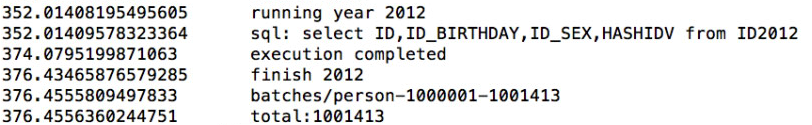

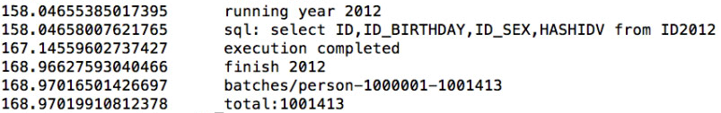

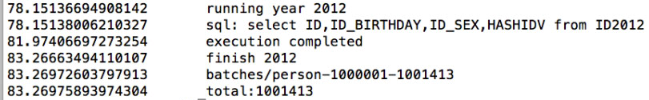

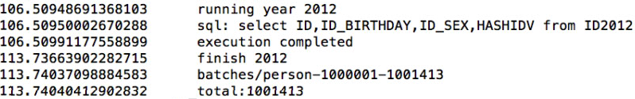

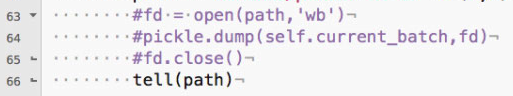

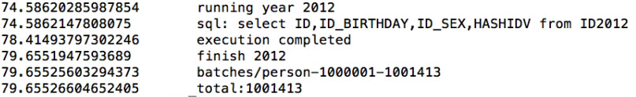

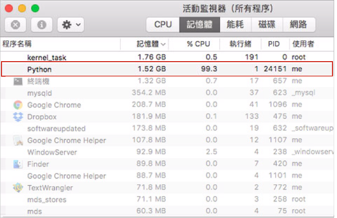

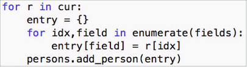

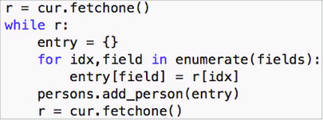

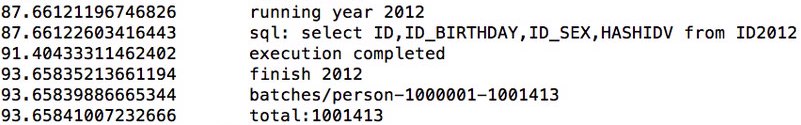

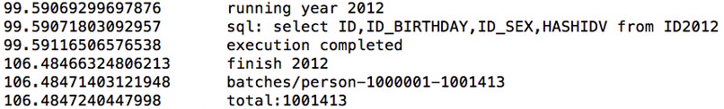

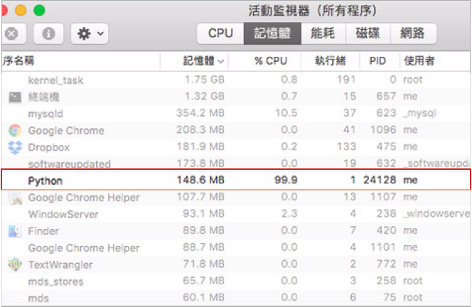

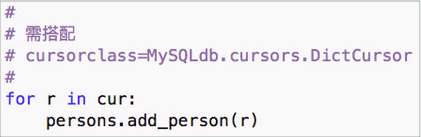

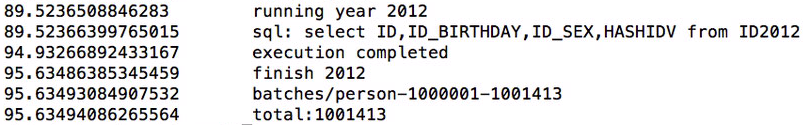

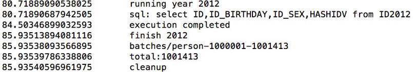

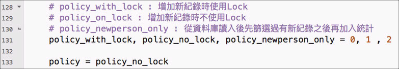

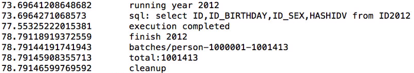

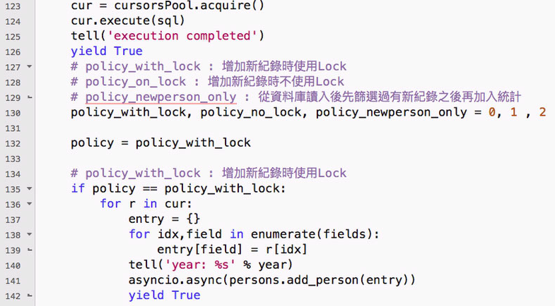

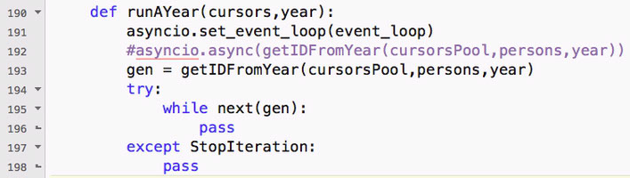

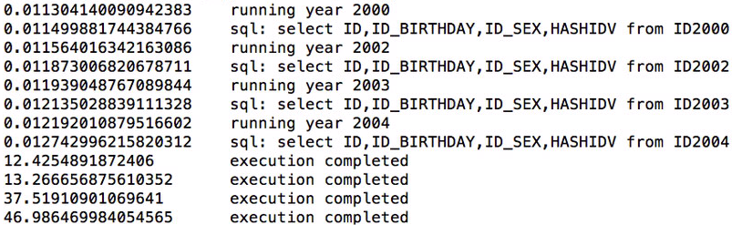

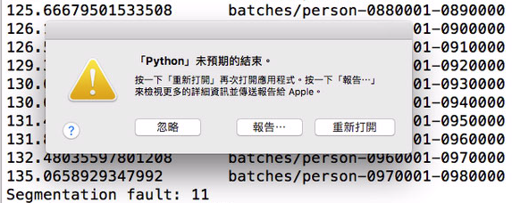

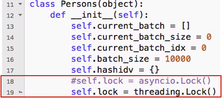

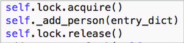

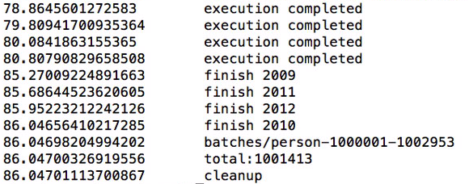

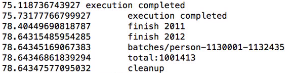

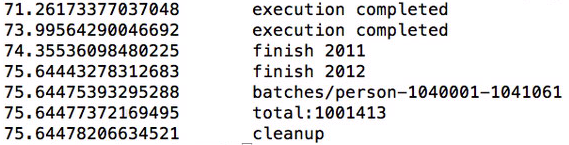

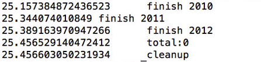

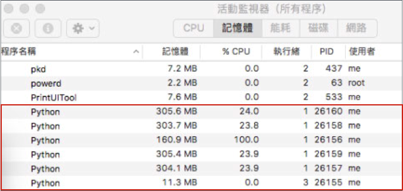

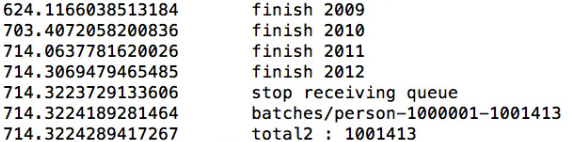

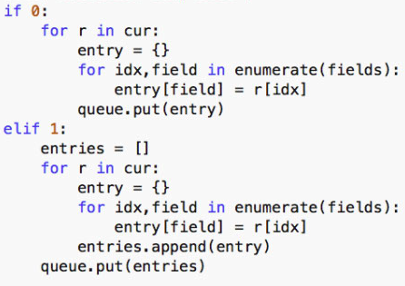

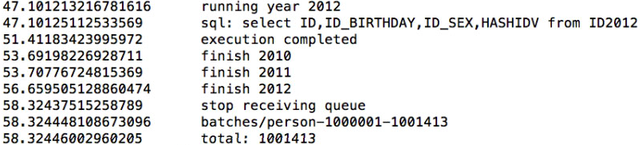

.. |IMG34| image:: static/python3parallecomputing_33.png
   :height: 101 px
   :width: 608 px

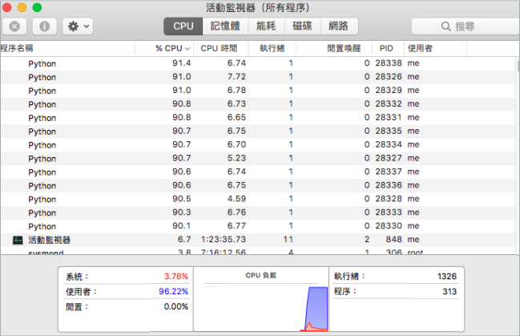

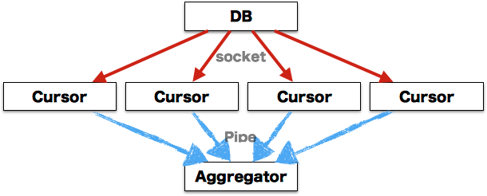

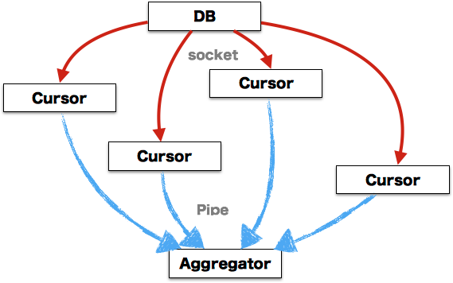
