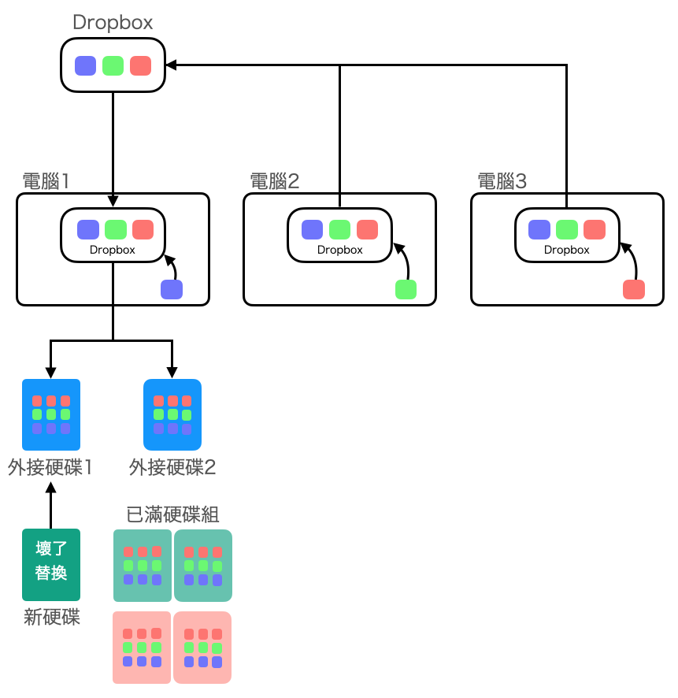

# 關於備份

Created: June 7, 2023 5:42 PM

version: 2023/6/10

本文是關於一般電腦使用者不額外花錢、不靠特殊軟體之下，就可以進行的檔案備份。屬於陽春型的備份方式，陽春雖然簡單、笨拙，但是容易成功。備份成功最重要。

## 詞彙說明

- 檔案/檔案目錄/文件/圖片/照片/影片/壓縮檔（以下通稱「檔案」）
- 筆電/桌機/手機/平板（以下通稱「電腦」）
- Dropbox/OneDrive/Google Drive（以下通稱「雲端」）

## 基本事實

- 所有的電腦都會壞掉
- 讀取檔案的應用程式可能會改版或者消失（公司倒閉）
- 檔案格式可能會被時代淘汰（ex. flash 的.swf, .fla）
- 作業系統會改版，應用程式可能無法再安裝
- 你可能會換作業系統，例如從windows改用mac，或者相反。
- 存放檔案的設備也會壞掉，不論它是哪一種儲存設備。硬碟,SSD,CD等等。
- 雲端只是別人的電腦跟硬碟。

## 備份的策略：隨時保持至少兩份

所謂的2份是指以下的範例：

- 一份在電腦，一份在USB外接硬碟。
- 一份在電腦，一份在雲端。
- 一份在電腦，一份在NAS/RAID。
- 一份在手機，一份在OTG的大拇哥。
- 一份在手機，一份已經同步到電腦。

然而，大部分的情況下，由於電腦、手機本身的儲存容量不夠，因此我們會把檔案複製出來，然後把電腦、手機上的檔案刪除。在這個場合，上面所說的2份不是2份只能算是一份，因為其中一份已經被刪除。以下才是2份的範例：

- 一份在電腦，一份在USB外接硬碟A，一份在USB外接硬碟B。
- 一份在電腦，一份在雲端，一份在USB外接硬碟A。
- 一份在電腦，一份在NAS/RAID-A，一份在NAS/RAID-B。
- 一份在手機，一份在OTG的大拇哥A，一份在USB外接硬碟A。
- 一份在手機，一份已經同步到電腦，並且複製到USB外接硬碟A。
- 不限於以上的組合，以上只是幫助了解所謂「2份」的意思是同時在物理上有兩份（在2個物理上不一樣的儲存媒體）。

## 看得到檔案內容才算數

- 必須確保檔案可以再開啟，也就是有應用程式（reader application）可以讀出內容。
- reader會改版或者公司倒閉，作業系統也會更新改版，所以必須確保reader application可以在新版的作業系統上安裝與執行。以及新版的reader可以開啟以前備份下來的檔案。因此應該盡量以常見的格式備份。(小心，Word檔案內嵌的圖片會「毀損」，這是實際發生的案例）
- 經常要確保儲存備份的硬體是否正常。例如USB外接硬碟是否可以正常讀取。一旦發現壞掉，要儘快買新的並且重新複製一份。複製的時間可能很久，在這期間還沒有壞掉的另一個外接硬碟也可能快壞掉，所以複製時要非常謹慎小心，空窗期越短越好。
- 要確保儲存媒體有硬體可以使用。例如，磁碟片floppy，因為現在幾乎找不到軟碟機，就算軟碟片沒壞，檔案也已經讀不出來。或者像是以前SONY的長條形記憶卡也已經沒有讀卡機可以讀取。所以當你的儲存媒體已經快絕跡時，就要趕快換到新的儲存媒體。大的USB-A接頭，也逐漸改成USB-C的小型接頭，必要時也要考慮準備一個大轉小(USB-A轉USB-C）的轉換接頭。

## 關於備份的一些提示

- 雲端同步不是備份。當你錯誤地刪除某個檔案時，要能「找回來」，這才是備份。雲端同步時，誤刪掉的檔案一樣是不見了。
- RAID不是備份。RAID是當有一個硬碟壞掉時，儲存系統還能運作，檔案還在。但是，放在RAID內的資料還是只有一份。而且RAID也會壞掉。RAID的硬碟可能會在重建過程中又壞掉，RAID系統本身也會壞掉，硬體RAID也一樣會壞。
- 有些圖文兼備的文件可能不只是一個檔案，而是一整個目錄都是文件的一部分。要複製整個目錄，而不只是一個檔案。例如，有些文件會把圖片放在跟檔案同一個目錄。HTML檔案是其中一例。若有不確定時，可開啟已經備份出去的檔案，看看是否能看到完整內容（記得捲動到最底部）。新版本的word是xml格式，內嵌的圖片可能也是另外存放，所以最好是確認你的備份包含了完整的全部所需要的檔案。
- 有些檔案實際上只是一個連結(symbolic link)，必要時需確認所備份的是真正檔案的內容，而不只是檔案的連結（可以從檔案的大小看出來，但通常不容易發現）。重要的檔案還是把備份出去的檔案找一些樣本實際「開啟」看看，確認過比較妥當。如果備份到的只是「連結」，一旦搬動所在的目錄通常（不是絕對）就失效導致無法開啟。

## 參考案例

以下是我個人的備份方案。風險自負，謹供參考：

- 準備2個USB外接硬碟
- 在筆電硬碟的目錄上作一個備份的目錄，作為備份的總目錄。
    - 我是把這個目錄放在本機Dropbox的目錄下。把這個目錄放在雲端的好處是，萬一電腦臨時壞掉時，還有雲端的檔案在。還有一個好處是因為我同時使用好幾台筆電與桌機，共享同一個Dropbox帳號。不同電腦上要備份的檔案可以一致性處理。
    - 我也會把還在開發中的專案的工作目錄直接放在Dropbox之下的子目錄當中，雖然檔案經常在變動，我個人沒遇到有同步錯誤的問題。那樣就省了一道本機之間複製檔案的功夫。我曾經把開發中的專案的工作目錄放在OneDrive之下的子目錄，卻發生過無端生成好幾個「衝突版本」、「跟衝突版本衝突的新版本」（好幾層衝突），甚至有舊的內容把新的蓋掉、檔案在我眼前突然消失的情況。我用Dropbox十幾年從來未曾出過狀況。如果使用OneDrive需要謹慎些。
- 所有要備份的檔案，都放到那個目錄之下，根據專案的不同，分類成數個子目錄，或者子目錄之下的子目錄。子目錄的分類與命名很重要，要可以幫助你在複製出去時，容易找到有變動的檔案。目錄名稱加上日期是一種方式。
- 定期手動將備份目錄內新增或有異動的檔案複製到2個USB外接硬碟上。
    - 所謂「定期」就是如果你覺得電腦臨時壞掉時，那些檔案消失你會無法接受時，那就是備份的時機。
    - 複製一個很大的目錄經常會半途而廢。分次複製，每次複製小一點的目錄是最省時省力的方式。
    - 因為我的Dropbox是免費的只有5GB，所以快滿的時候，我就整理一下備份到2個外接的USB硬碟，然後把本機的檔案刪掉清出空間來。容量小的好處是它會強迫你不能一直拖延該做的備份。
- 我只備份檔案不備份應用程式。這是因為我用的軟體幾乎都是Mac OS本身自帶的軟體所額外得到的好處。我寫的在Linux上執行的程式也都只是純文字檔，很多軟體都可以讀取。在備份上的複雜度不高（例外是開發iOS跟Android app 的原始程式碼，非本文重點在此不談）。如果你有重要的應用程式的設定檔，需注意要定期輸出設定檔到備份區的目錄以便於備份。此外，因為我用MacOS，它自帶「時光機」的備份軟體，有這軟體可以省很多錢，也少了下載到內藏病毒的軟體的風險，只要準備好一個專用的USB外接硬碟就好，不必煩惱系統與應用程式的備份問題。使用Mac的人千萬不要浪費，Mac雖然貴但光是這一時光機就值回票價。但是，「不同的Mac機型」不能通用時光機的備份。自己檔案的備份還是必要的。
- 下圖是我備份方式的架構的簡單示意圖。如果你只有一台電腦，不必靠雲端服務(Dropbox)串場也是可以的，缺點是當唯一那台電腦（的硬碟）壞掉時，還沒備份的檔案就沒了而已。

