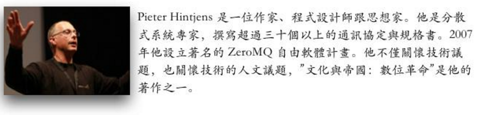

.. _h761ab401543201137a78553757464:

\ |IMG1|\ **********

.. _h38696e1f644f3720725f1579511f303f:

臨終協定(A Protocol for Dying)
******************************

原文：\ |LINK1|\ 

翻譯日期：2016年4月24日

(譯文開始）

\ |LINK2|\   寫於 2016年4月22日11:43分 

我寫最後一篇的時候到了。如果我有時間處理所有的事情的話或許我會再多寫點，但此後，我得要把注意力放在床上最舒適的姿勢、打止痛藥的時間以及我身邊的人了。

昨天我有十二個訪客，包括我可愛的小孩，你可以想像那是有點虛脫的感覺，絡繹不絕的朋友跟家人，就像一場豪氣十足，熱水無限量供應的泡澡。

我曾經是一個與社會斷絕聯繫又孤單的年輕人，也許有點自閉，心中只有工作、游泳跟幾隻貓。對於「跟其他人跟在一起會感到快樂」這種想法感到奇怪，不過我的工作還算有點價值，至少我自己是這麼想的。我們用Cobol寫程式產生器，我寫的編輯器在公司中很快受歡迎，因為它運作的非常好，而且能在我們所有的系統平台上執行。我自學C跟8086組合語言，還寫過幾個工具性的共享軟體。

久而久之我發現如果跟陌生人交談，任何形式的互動過程（例如買熱狗、雜貨的場合）對方都會愉快地回應，這變成我的藥癮，就像那些喝咖啡慢慢上癮的人一樣。

它逐漸變成基本的，然後又變成我工作的目地：到陌生的地方去見不同的人。我喜歡參加研討會，因為在那裡找人講話不需要想藉口，每個人都喜歡而且想要講話。我很少在那裡討論技術性議題。如果你覺得應該要討論的話，讀程式碼去吧。

因為這樣，這幾十年來我很自豪我的實際工作就是找人講話、聽他們講什麼，跟他們交流，然後綜合起來再分享給其他人。我總共在歐洲、美洲、非洲與亞洲做了上千場對談，我樂於接受任何人們說我有創意、聰明等等的讚譽。其實那些我曾參與打造與撰寫的模型或理論，一直都是採擷於現實生活中與其他人的互動。

感謝你們，我的朋友們，因為你們才有那些。當我說 ” 我愛你們 ” 時是有言外之意的，可以說其實是你們一直在專業上與知識上灌溉我。

所以，我要寫下這個最後的模型，這次是關於如何面對死亡，我付出一點時間來給大家道破一些直率了當的知識。這次我寫的不是規格書(RFC; Request for Comments)，無法再請大家給意見了 :)

.. _h5c462122702e7cc06763134049d56:

事情是怎麼發生的？
==================

技術上來講，我所罹患的膽管癌已經轉移到左右的肺部。從二月份開始乾咳，疲憊感越來越沈重，而且無法再專心工作。三月份我父親過世我們忙進忙出辦理他的後事時，咳嗽一直跟著我。四月八日我去找醫生跟她說我很不舒服，她替我安排了緊急的電腦斷層掃描(CAT Scan)跟抽血檢驗。

四月十三日進行可怖的內視鏡及切片，四月十五日作正子斷層掃描(PET Scan)，四月十六日本來我打算開車到Eindhoven去NextBuild公司演講，沒去成反而是進了急診室，作切片那一側有劇痛，打了抗生素之後疼痛才感到紓解。四月十八日腫瘤科醫生確認是癌症轉移，我無法出院得要繼續留下來，我的主治大夫正在考慮要進行怎樣的化療，我罹患的癌症在歐洲病例不多，具體的資料很少。

我們所確知的是膽管癌對化療的反應不佳，再者，我身上這癌症很兇而且移動得很快，第三，身體其它地方（肺部）已經發現有癌症轉移，這些都是清清楚楚的具體資料。

所以，那一天我對外公開了這個訊息，並準備面對死亡。

.. _h2164242e4c6048506f23311549231654:

與臨終者交談
============

與臨終者談話可能很艱辛，我們暫時稱他為Bob，其他人稱為Alice，以下幾點是Alice不應該對Bob說的：

* ”撐著點！你必須保持希望，你必須擊敗它！” ，你要假設 「Bob已經盡力去擊敗病魔了」，這個假設不會錯的，就算他沒有，那也是他的選擇。

* ”好悲慘，我好難過，你不能死”，我女兒曾對我講過這句話，我當時跟她說這是無可爭論的現實，死亡是不允許我們選擇的。對事實生氣或難過是在浪費時間無法改變事實。

* ”你一定可以打敗它！不試怎麼知道” ，這是Alice在表達她的期望。錯誤的期望不是治療，好的化療藥劑或者解痛劑，那才是治療。

* “傳聞有一些實驗性病人被醫好了”，這句話讓我很想拿鎚子，還好對我講這種話的人不多。就算真有仙丹妙藥，也要考慮費用跟找到它對其他人所造成的壓力，我們大家都知道，找到的機率像中頭彩一樣渺茫，那樣做的話很自私也沒效益。人之為人，有生有死。

* ”讀聖經第幾章第幾節，會對你有幫助”，這種講法是既魯莽又失禮，再加上愚蠢與傲慢。如果Bob需要信仰幫忙的話，他自己會去找牧師，如果沒有就是他不想去。這句話也會讓我想拿鎚子。

* 躡聲躡語吞吞吐吐地探問是一種消極性的騷擾。讓Bob一再反覆回答一些細微、無聊的蠢問題。例如「我把你吵醒了嗎」，很可能Bob根本沒有心情跟你作無意義的閒聊亂扯，他要麼想要人們親近他，身體性的，要麼跟他講些有趣的事情（下面會講）。

此外，不要打電話給他然後在電話上哭，如果你感覺快要哭了，先掛斷電話等個十分鐘後再打。流眼淚不是問題，可是對Bob而言「感受到自己的悲哀」更令他完全陷入無盡的黑暗。我已經知道該怎麼主導自己的情緒，然而大部分的情況下Bob的心靈還是很脆弱的。

以下是Alice可以對Bob交談，會令他感到快樂的事：

* 曾經一起經歷過的陳年往事。”還記得那時候嗎？”，”喔！我想起來了，...，真棒！”

* 診療的細節。Bob現在困在病床上，他經歷林林總總行禮如儀的療程、醫護人員、藥物以及他罹患的疾病等等。我會立刻靠上前去傾聽Bob跟我分享。

* 幫忙Bob處理技術性問題（譯註一）。要讓生活井然有序很麻煩，需要人出手相助與心力關照。

* 假若Bob像我一樣是個作家的話，可以跟他說”我買了你的書”這一類的話，不管是基於阿諛奉承或者真心都能讓Bob會心一笑。

還有，除了快樂之外的其他情緒不必透露。記得，不要給他出新的功課。

譯註一：可能是指一些無關心理、情緒性層面的事情。例如跑跑腿買點東西之類，形而下的事情。

.. _hd2c7c665628103f15a762c63776630:

Bob的責任
=========

不是全部都是Alice的事，在此協定中Bob也有他的責任，至少有以下幾件事：

* 常喜樂。這點聽起來有迂腐但它是必要的。如果Bob鬱鬱寡歡，Alice每次跟他講話也會跟著心情沮喪。

* 無庸置疑，Bob必須把自己的事情處理好。既然已經預期到來日無多，應該盡力讓自己變得可有可無。在家庭上，這不可能做到，但是在工作上是做得到的。我已經被認為會死好幾年了，所以這幾年來我已經把自己從活躍的ZeroMQ社群裡面抽離。

* 減少所有能減少的壓力跟花費。例如，比利時可以安樂死，我已經告訴醫生請他們準備了。（不是現在！時機到的時候...）我會請人們當我還活著的時候來道別，不必辦喪禮。我準備把大體捐給大學，如果他們要的話。

* 認清現實，願望不是醫療，這點我已經解釋過了。如果你打算跟你的醫生協商，那麼討論些實用性的，讓其他人都能受惠的議題。我已經告訴我的醫生，如果他們想在我身上實驗任何化療藥物就儘管去作。他們獲得了數據，而我起碼也對這個讓我多活了五年以上的醫療系統作點貢獻。

* 作最壞打算。我的腫瘤醫師當時一看到我的片子馬上打電話給我，說她研判是癌症。左右兩邊的肺部都有，處處可見。我放下電話，告訴孩子，隔天我也把最壞的狀況告訴孩子們的學校，然後是家庭律師、公證人。十天之後，切片病理檢驗確認是癌症，這額外的十天讓我有時間作準備，也讓我自己有時間替自己感到悲傷。

* 坦誠、透明地面對其他人。其他人需要有時間去悲傷，如果他們能在Bob還能講話時跟他討論的話，處理後事相對會簡單得多。沒什麼好難以啟齒的，死亡並不是失敗。

.. _h2164242e4c6048506f23311549231654:

向孩子們解釋
============

我的小孩分別是12歲、9歲、5歲。悲劇啊等等等，沒有父親陪著長大。這是現實。他們長大的時候，我活在他們的DNA裡面、活在Youtube上無盡的會議演講裡面，活在我的文章裡面。

這幾年來我已經慢慢地向他們解釋很多遍，終有一天我會走，或早或晚。每個人都會死，是的，小Gregor，你也是呀。那是生命的一部分。

小Gregor，想像你有一盒樂高玩具，你拼了一棟房子，留著它又一直繼續拼新的房子，舊的都不拆掉的話會發生什麼事？”盒子會變成空的，爹地”，很好，這就對了，那麼你能繼續蓋新房子嗎？”不可以，不行了” 。嗯，我們就像樂高遊戲的房子，死了以後我們會被拆解，就像回到盒子裡，讓新的身體可以被生出來，這就是生死之轉輪。

不過，他們最常看到的是自己的老爸快樂又輕鬆（不是因為止痛劑的緣故），而且好幾個禮拜都感覺蠻正常地在跟他們說再見。我好感恩沒有突然掛掉，我好感恩沒有像植物人那樣失去心智。

而且我已經告訴我的孩子們要會游泳、騎單車、溜冰跟射擊，要會煮東西、要去旅行，要去露營，要會使用新的科技不必害怕。Gregor三歲的時候就在玩麥塊（Minecraft）左手鍵盤右手滑鼠。Noemie七歲的時候就學會用手槍。他們會講好幾種語言。他們有自信而且學得很快，就跟他們老爸一樣。

每個人都應該認識死亡的意義。構成一個完整的個體的核心之一就是接納自己生命有限的真相。當然，我們要為活下去打拼，然而當它要成為過去的時候，我們就擁抱這個終點吧。我很高興自己能把這門功課親自傳授給孩子們，以前從來沒有人會告訴我這些事情。

.. _hd1b83d48586e1b393a624e28544946:

安樂死
======

我很慶幸自己最後還是沒有離開比利時。這個國家允許臨終或生命品質已經糟糕透頂的病人自主地選擇結束生命。後者需要經過三個醫師及一個精神科醫師的評估，以及四個禮拜的緩衝期。若是前者則只須一個醫生的評估意見。

我父親是安樂死的，他選擇在週二復活節，那時我們好幾個家人陪伴他經歷一個簡單又安詳的過程。第一劑注射讓他進入昏睡狀態，第二劑讓心臟停止跳動。當時我覺得這樣死法不錯，雖然當時我不知道接著輪到我病了，（總之）安樂死是我已經想過的事。

令我感到震撼的是，都已經是2016年了依然很少國家允許安樂死，強制要求病人承受腐爛的折磨後與無效的急救（譯註二）。安樂死跟癌症特別有關係，因為癌症是主要的死因之一。如果你所屬選區的民意代表反對的話，請他抽空讓你能跟他遊說一下，關於尊嚴地死亡才是正確的方式這件事。

譯註二：可能是指因急救過程中，因一再的電擊造成皮膚燒焦或因插管而造成潰爛的情況。

.. _hd7b751276e3b5a272340277219674:

我對這整件事情的感覺
====================

我從來不是一個怕事的人。關於我成為「\ |LINK3|\  （\ |LINK4|\ 形容得很好的那個）」這件事情，我的死亡大筆一揮讓我能淡然面對它在事業與社會上所產生的風險，也讓我們能夠在「權力遊戲 Game of Thrones」計畫結束後淡定下來。那從來不是真正的我，只是恰巧在那個時間、那個地點我扮演了那個必須讓事情繼續運作下去的角色。

準備了多年好去面對這一切，親眼目睹數個精心籌劃的計畫同步進行的壯觀場面，讓我深深感到心滿意足。從2011年開始我成為手槍射擊專家、自學彈鋼琴（還自編了幾段小曲），能親眼見到自己的小孩長成具有快樂、朝氣蓬勃的性格，寫了三本書，還指導ZeroMQ社群能具備穩重可靠的特質。Bob如我，夫復何求？

這裡的醫護人員很親切，我沒有任何抱怨，我只有感恩所有的朋友，這幾年來你們帶給我歡樂，也感謝那些維持我性命跟活力的藥物。

謝謝你們 ！ :)

.. _h2164242e4c6048506f23311549231654:

替孩子們著想
============

請用這篇文章來增添你的故事。如果你把故事寫在別的地方或曾經Email給我的話，請複製/貼上在本篇下方的評論(Comments)上。你想要寫荷蘭文或法文的話，請便，如果那是你使用的語言。我想讓孩子們從一個地方就可以知道他們的父親在別人口中是怎樣的人，這樣會比較好。

許多想捐點給錢幫助孩子們的人在問我的Paypal帳號是： ph@imatix.com 。

（譯文結束）

.. _h2c1d74277104e41780968148427e:

..  Note:: 

    通訊協定(Protocol)是指進行網路連線時互相約定的規則，用於對連線雙方進行資訊交換時，規範使用的術語、資料格式與溝通程序，以使得通訊雙方得以完成訊息交流的目的。

Pieter Hintjens 的參考資料：

* \ |LINK5|\ 

* \ |LINK6|\  部落格

* \ |LINK7|\ 

* \ |LINK8|\ 

* \ |LINK9|\ 

* \ |LINK10|\  這個計畫要建構完全安全但匿名的P2P網路

* \ |LINK11|\  。

* \ |LINK12|\ .（Gitbook 電子書）

* "\ |LINK13|\ " 最近的著作（Gitbook 電子書）

* \ |LINK14|\  撰寫中（Gitbook 電子書）

譯後語
這篇文章的內容涉及面對臨終者的態度，生死事大，如果譯文有錯誤的地方，非常歡迎告訴我修正。

我們都有機會面對臨終者，遲早有一天我們也都會成為臨終者，然而在成長過程中很少有機會學習如何地去面對臨終相關問題，如果因為無知而犯錯，將會是無法彌補的，一輩子都會在良心上感覺到虧欠。

我翻譯這篇文章，並非主張本協定的內容可以完全原封不動地套用到每一個個別的情境。不僅是文化差異而已，甚至不同的家庭、臨終者的性格特質、彼此的角色等等都需要列入考量（例如關於提起聖經章節這一件事），這個議題是沒有SOP的，每個個案都有屬於該個案當下的協定。如果是家屬或者病患本人，或許可以向醫院的社工師作相關諮詢。

雖然具體的行動要因人、因事、因地制宜，然而，我相信這份協定的內容在原則層次是跨越文化而共通的，例如，雙方都有責任與義務坦然面對臨終這件事，以及人應該有選擇死得有尊嚴的權利，還有那些從臨終者角度出發的觀點所象徵的尊重臨終者主觀意願的態度，都是很有價值的觀點。

\ |LINK15|\ 就可以發現台灣已經有很多人在倡導與臨終、安樂死相關的理念，值得我們向她/他們致敬，但我相信他們的努力還沒有受到應有的重視，對於這個議題，我們還有很多要努力的地方。

.. bottom of content

.. |LINK1| raw:: html

    <a href="https://l.facebook.com/l.php?u=http%3A%2F%2Fhintjens.com%2Fblog%3A115&h=ATOdLI78mjXKez0JfYw13Yn7ty_m51UBEH38JSRp8Pt1hnYVcpMbmjgzEaB2Gq7MtDt_q7OE9zzji8LBwEasqBRhizR18-N9TepaIdWX6PGiqxcFW7MNwESzvQiLod2bZp8C78seHxqa&s=1" target="_blank">http://hintjens.com/blog:115</a>

.. |LINK2| raw:: html

    <a href="https://en.wikipedia.org/wiki/Pieter_Hintjens" target="_blank">Pieter Hintjens</a>

.. |LINK3| raw:: html

    <a href="https://l.facebook.com/l.php?u=http%3A%2F%2Fhintjens.com%2Fblog%3A21&h=ATP38R4b1eAQzUuSjdTPHLMtrnoKJ-5YJOpbmz27Qa4OzeVVpbko9tet-7EgjbM_njyieZc6tlVtaqtfrVY3zyJ_RvEMiikfoXjegcF421BFjj_TOjXQ2jf73sgWbfM-xg_hzrRVmRND&s=1" target="_blank">掠奪者角色</a>

.. |LINK4| raw:: html

    <a href="https://l.facebook.com/l.php?u=http%3A%2F%2Fallen.typed.com%2Fblog%2Fhintjens&h=ATM8-wqdljLaxo7SN3MXaTk3tAgHa6Oj0NfbUwDaLPvssCiI-6HAP5CYPN9ZD1pQz5kIK2k3oxvsLZphGmgR1qScGYYdLRylK3jqUiSJvMlTlKiJp5YYkah2r3EbmQBtBAdkwBSs50HC&s=1" target="_blank">Allen Ding</a>

.. |LINK5| raw:: html

    <a href="https://l.facebook.com/l.php?u=https%3A%2F%2Fen.wikipedia.org%2Fwiki%2FPieter_Hintjens&h=ATNSmmM6NyVZO-XyqTI9tg-wdVKqJs32Cl4u66bP6AxRy4iBizc7ertMBRHzqMkG7Bg9IgI-QFg_57t59m0PkPslX1r2hlXKRetalEBFvbaKnuKWDvWQwUPTygVVlpU4Mo5NJna8JuvU&s=1" target="_blank">Wikipedia上關於Piter Hintjens 的條目</a>

.. |LINK6| raw:: html

    <a href="https://l.facebook.com/l.php?u=http%3A%2F%2Fhintjens.com%2F&h=ATNDYgDtKcj9XwXfsQHdbR0nR5igfWVTdpjDESpemi_hqNhAC8_AwzV-MSQPtAjPPyo-5cn90rwaCS3Rcv03niUJtqRFhgWKbCjZX4wl2eXRLPadmIale9ZT9sIJ-agtDASEHFgwNO8a&s=1" target="_blank">hintjens.com</a>

.. |LINK7| raw:: html

    <a href="https://l.facebook.com/l.php?u=http%3A%2F%2Fhintjens.com%2Fblog%3A74&h=ATMRgw9DnfKfGJvW3WoTR4U-5_k3NFnj105Pl09uWG_UiUzoOJ-OFjG5tiG_UTDtpNNBRJoTVugEeS0GMWlw0Tvlz4EKo_eQZ_ZibvD--s0neHxR7andBzDnQMeYy0SZlqy6KTsC_xa2&s=1" target="_blank">"Living Systems" 活生生的系統。</a>

.. |LINK8| raw:: html

    <a href="https://l.facebook.com/l.php?u=http%3A%2F%2Frfc.zeromq.org%2F&h=ATPmjQg-N3_rA4m-RHciMPnBOcQdGkHWOGydT-ddiAsihkwg5PeQuQ4FeHy1D7AZo_I4UgKYyUiLc3CFEDoQ3qVYlTkFG653jei17a96FG5x5eGzUBE4sdY287Lug4VU5lxZGM_h_Oui&s=1" target="_blank">ZeroMQ相關的通訊協定與規格</a>

.. |LINK9| raw:: html

    <a href="https://l.facebook.com/l.php?u=http%3A%2F%2Fzeromq.org%2F&h=ATOwYtmauYu6OWWQlmI1RQDqJl-X-YbTWRkUEykC_B8yIm6AV5FoYzX2DQiu5-vq6fxWjfvPLXF2IQgKjsn4Fhpa573dl_HHDtI8YWtVIIppWQktisP9dOQtGVW3aYd1_bXIAnv0d-j6&s=1" target="_blank">ZeroMQ自由軟體計畫</a>

.. |LINK10| raw:: html

    <a href="https://l.facebook.com/l.php?u=http%3A%2F%2Ftheedg.es%2F&h=ATPFiHIPXGtFi7mwUG_fCWAoUhy5c2AG3iqk6gjnVCSwJtuDeGC4GNKaNjDa1aAL3P73tnWz0FoJdDcEdzcYrBmzkkDeBMkHRQyPVIbeyHe0uG8PZU9v1llMxDpV3tANDNHJiaPDsNlF&s=1" target="_blank">edgenet project</a>

.. |LINK11| raw:: html

    <a href="https://l.facebook.com/l.php?u=http%3A%2F%2Fshop.oreilly.com%2Fproduct%2F0636920026136.do&h=ATPjvNlfSTUDDL3G1gAfKqfehqHD2daPfuFOpF2zcHYkGMSnVvEO7Dg3p1YK3kM0qpaDnUqYVyXjGcYqo0TSY7mnsaIHlWlgczBxwRhxx0iWpAB_fyQbKUHAIo4OHQwFeGREQcAqtAOE&s=1" target="_blank">"ZeroMQ - Messaging for Many Applications" (O'Reilly)</a>

.. |LINK12| raw:: html

    <a href="https://l.facebook.com/l.php?u=http%3A%2F%2Fcultureandempire.com%2F&h=ATPYn8Oy-wvi_wuOIqw2g7MdFOlZ7SDO7JzgFOLvZT4ZEtCq_hP9bqo-uvOtuzZsmCL-2gqTjbC6GZfj8QwjGPpcwxvO569oEc_bVGswCAXCVjBFV_3-xSdFBAz_8OaKFTCKk63gecFN&s=1" target="_blank">"Culture and Empire: Digital Revolution"</a>

.. |LINK13| raw:: html

    <a href="https://l.facebook.com/l.php?u=http%3A%2F%2Fpsychopathcode.com%2F&h=ATNYj9tvljjxVjN91bTqrXMWdfLECjet_jYpQNoTy7BDkNMEexYOnCWNuYLpM5hSP59SvbkGM4-IhHut4P-npTlRmboqqqiBkCAD58VAW0ZoMb9OUE2vV3-MUgfYj6kIn-NQ2zJcRMsX&s=1" target="_blank">The Psychopath Code</a>

.. |LINK14| raw:: html

    <a href="https://l.facebook.com/l.php?u=http%3A%2F%2Fscalable-c.com%2F&h=ATPttbbNzlN52j6mWFOLZIbr7KwLOhxEGdnYkSXJRM0rP0gCekufHXx57j4dQGt1w-il7s8PkgGccTh7uaxSI8iEvpwL8xeyOcn8bi0DH2zNyWFq4hSCLzqmZP0QZszPHftyfn5vw2V4&s=1" target="_blank">"Scalable C"</a>

.. |LINK15| raw:: html

    <a href="https://l.facebook.com/l.php?u=https%3A%2F%2Fwww.google.com.tw%2Fsearch%3Fnewwindow%3D1%26c2coff%3D1%26q%3D%25E8%2587%25A8%25E7%25B5%2582%2B%25E5%25AE%2589%25E6%25A8%2582%25E6%25AD%25BB%26oq%3D%25E8%2587%25A8%25E7%25B5%2582%2B%25E5%25AE%2589%25E6%25A8%2582%25E6%25AD%25BB%26gs_l%3Dserp.3...14393509.14404536.0.14404871.19.16.3.0.0.0.98.861.15.15.0....0...1c.1j4.64.serp..1.6.346.NCXZhCFLabM&h=ATPXddMaOExJ6iqXOkqX37YjjbHLkhGvU1TPoEgS2Bh9iOCmS4f5NzcRLFcHlfdD3pQYIQieRs8yKVKHHzTCRmDAUB-glXuq9RAzP9I1IN0n46g3lrgXz4VOxmwsD9DWi816Tot1CdKe&s=1" target="_blank">Google一下</a>

